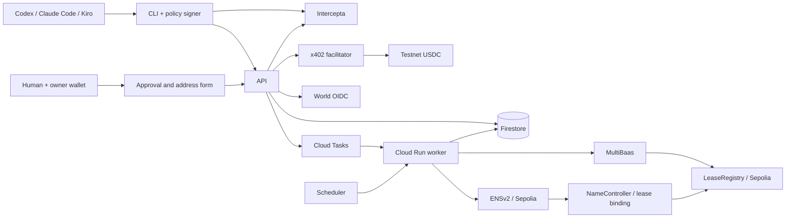

# 技術設計 v2 — GCP / Firestore

ユーザー指定: 郵便関連はWorld人間承認後の「郵便転送可」表示と、人間用の宛先フォームまで。実発送は行わない。

## 1. 構成

TypeScript strict / pnpm workspace。公開説明ページはbuild時にHTML生成、保護画面はReact/Vite静的UI、Fastify API、Firestore Native Standard、request駆動worker。ジョブはFirestore outbox + Cloud Tasks。Solidity + FoundryのLeaseRegistry、viemの署名・receipt処理。T-01で実際に互換性を確認したversionをlockfileへ固定する。

UI/APIは同一Cloud Runサービス、workerは非公開の別Cloud Runサービス。ともにrequest-based / min instances=0。UI/APIは同じHTTPS origin。GCS、GitHub Actions、Tasks/Scheduler、Firestore実装詳細は[インフラ仕様](../../../docs/infrastructure.md)を正とする。3ツールの実利用は共通HTTP/JSON CLIで対応し、MCPを必須にしない。

既存サービスと同一のGCP projectを使用する。専用リソースは `RESOURCE_PREFIX=realaddr-event` で命名し、Terraform state、実行主体、secret、image、queue、bucketを分ける。既存projectのFirestore `(default)` は参照する共有資源であり、このアプリのstateへimportせず、DB本体・既存rules・他サービスのIAMや設定を所有しない。共有資源の管理境界、衝突時の停止条件と適用前確認はインフラ仕様に従う。基盤の登録と専用主体の代表IAM検査は実施済みで、アプリ配備・外部統合は未完了。実施範囲は実装状況に記録する。



予定ディレクトリ: apps/web（公開HTMLとapp/adminの共通UI）、apps/api、apps/worker、packages/domain、packages/db、packages/integrations/{world,intercepta,x402,multibaas,ens}、packages/agent-cli、contracts、tests/{integration,e2e,live}。

決済chainはBase Sepolia eip155:84532を第一候補。ENSv2とLeaseRegistryはEthereum Sepolia eip155:11155111に統一する。T-00でfacilitator/assetとMultiBaas Sepolia対応を確認。支払い確認からの記録は事業者backendによる証明で、cross-chain proof/bridgeではない。Worldの利用はWorld Chainへのdeployを前提にしない。

## 2. 権限

Agent bearer=アプリ主体、x402=決済、owner wallet署名=契約制御、World=人間認証、明示同意=mail.enable許可。これらは独立して検査する。Worldのみで法的本人確認完了を意味しない。

署名器は顧客側プロセスで秘密鍵とIntercepta keyを環境/OS storeから読む。LLMには操作名と結果だけを渡す。shell全権を持つAgentから鍵を完全隔離する保証はしない。商用では専用署名サービスへ分離する。ハッカソンはテスト用EOAのみ。

初回人間承認では、Leaseのpayerと同じownerWalletを人間がブラウザwalletで署名して証明する。デモでは同じテストEOAをCLI署名器と人間walletに設定する。この証明は技術的制御権であり、実名や法的責任者の証明ではない。

## 3. データモデル

UUID、Firestore Timestamp（APIはUTC ISO 8601）、schemaVersion。金額はAPI/DBとも10進整数文字列、演算はbigint。slotはrepositoryで整数1..65535を検証。FirestoreはSQL CHECK/外部キー/一意制約を提供する前提にしない。以下の「一意」「PK」は論理要件であり、決定的document IDと同一transaction内のguardで実現する。

以下のcollection名と本仕様群のdocumentパスは論理名である。`packages/db` の単一mapperで、許可した論理名を `FIRESTORE_COLLECTION_PREFIX=realaddr_event_` と連結した物理名へ変換する。例: `orders/{id}` → `realaddr_event_orders/{id}`、`admin_principals/{id}` → `realaddr_event_admin_principals/{id}`。補助collection、guard、outbox、管理用collection、集計、indexのcollectionGroup、seed・掃除・snapshotにも同じ対応を適用する。HTTPのAPI名や既存document IDは変更しない。

event起動時はprefix空値・不正値・設定の不一致を拒否し、未prefixのcollectionへのfallbackや本アプリ外のcollection列挙・処理をしない。DB/環境/prefixはリクエスト入力から選ばず、検証済みserver設定で固定する。運用開始後のprefix変更は空DBへの切替として扱わず、明示的な移行作業にする。prefixは名前の衝突を防ぐもので、共有DB内のIAM隔離ではない。既存Security Rulesに広い許可がある場合、追加denyでは打ち消せないため、本領域の直接アクセス拒否を確認できるまで公開しない。

| Collection | 主なフィールドと論理制約 |
| --- | --- |
| tenants | id, status, termsVersion, termsAcceptedAt |
| agents | id, tenantId, walletChain, walletAddress, name, status; wallet identity一意 |
| api_credentials | id, agentId, secretHash, scopes, expiresAt, revokedAt |
| wallet_challenges | id, purpose, address, chain, domain, nonce, sessionId?, resourceId?, expiresAt, consumedAt |
| buildings | id(UUID), slug, publicLabel, publicArea, postalAddress, plan, addressUseEnabled, policyVersion, version, updatedAt |
| slots | buildingId, slotNumber, state, heldByOrderId, holdExpiresAt; PK(buildingId,slotNumber) |
| leases | id, tenantId, agentId, ownerWallet, buildingId, slotNumber, addressSnapshot, status, startsAt, expiresAt, version, chainSyncStatus |
| orders | id, agentId, createdAt, addressSnapshot, locationVersion, kind(purchase/renew/ens_addon), leaseId?, slotRef?, bodyHash, pricingVersion, ensNameSnapshot?, amountAtomic, network, asset, payTo, expiresAt, status |
| payments | id, orderId 一意, payer, authorizationNonce, payloadHash, status, txHash, settlementEvidence; 一意(network,asset,payer,nonce) |
| idempotency_keys | principalId, method, path, key, bodyHash, resourceId, responseSnapshot; composite 一意 |
| risk_assessments | id, orderId, side, subjectAddress, paymentNetwork, riskNetwork, decision, reasonCodes, responseHash, checkedAt, expiresAt, policyVersion |
| human_bindings | id, leaseId 一意, ownerWallet, encryptedIssuer, encryptedSubject, keyedSubjectHash, createdAt |
| approvals | id, leaseId, agentId, actionHash, nonce, targetDestinationVersion, targetProfileVersion, status, expiresAt, authTime, consentAt, bindingId?, appliedAt, destinationWriteAuthorized, destinationWriteConsumedAt? |
| oidc_sessions | id, approvalId, stateHash 一意, nonceHash, encryptedPkceVerifier, browserSessionId, expiresAt, consumedAt |
| browser_sessions | idHash, ownerWallet?, walletProvedAt?, candidateIssuer?, candidateSubject?, worldAuthTime?, expiresAt |
| mail_profiles | leaseId PK, status, enabledByApprovalId?, approvedDestinationVersion?, initialDestinationPending, destinationVersion, version, encryptedDestination?, destinationConfigured, updatedAt |
| refunds | paymentId PK, orderId, reason(issuance_failed_final), originalPayer, network, asset, amountAtomic, signerAddress, transferNonce?, encryptedSignedTx?, txHash?, status(prepared/submitting/unknown/confirmed), settlementEvidence?, createdAt, updatedAt, version; 一確定paymentに一件、宛先・額は元決済から固定。confirmedが返金記録の終端状態 |
| outbox | id, aggregateId, version, eventType, payload, state, availableAt, attempts; 一意(aggregateId,version,eventType) |
| admin_operations | operationId PK, kind(payment/registry/ens), targetId, status, version, lastErrorCode?, nextAttemptAt?, updatedAt; 安全な一覧専用projection。元の業務状態と同一transactionで更新 |
| ens_namespaces | buildingId PK, parentName, locationSlug, namespaceName, upperRegistry, locationRegistry, expiresAt, status, version; 拠点ごとのregistry接続と期限 |
| ens_bindings | leaseId 一意, nameType, label, normalizedName 一意, namePolicyVersion, nameNode, labelHash, leaseKey, ownerWallet, resolverAddress, registryAddress(locationRegistry), controllerAddress, targetLeaseVersion, syncedLeaseVersion, status, expiry, txHash?, verifiedBlock?, lastErrorCode? |
| ens_entitlements | leaseId PK, state(pending_payment/paid/refund_pending/refunded), intentId, nameType, label, normalizedName, namePolicyVersion, paidPaymentId?, paidAt?, pricingVersion, version; 一lease一つの初回購入と支払中の排他。返金後も支払い履歴を消さない |
| chain_cursors | chainId, contract, finalizedBlock, blockHash |
| audit_events | eventId, actorId, action, targetType, targetId, reason, beforeVersion?, afterVersion?, idempotencyKeyHash, result, traceId, occurredAt, redactedDetails; 秘密値なし |

すべてのresource参照でtenant/agent/leaseの整合性を検査。slotsとleaseを同一transactionで更新。発行済み(buildingId,slotNumber)は決定的slot documentを残し別leaseに使用不可。renewは同じleaseを更新する。承認はleaseごとに有効なpending/authenticatedを一つとし、approval_headsとversionのtransaction比較で直列化する。uniques、slot_shards、wallet_hold_quotas、rate_limits、daily_purchase_budgets、signer_nonces、chain_submissionsを補助collectionとする。各guardと割当algorithmはインフラ仕様に従う。管理用にadmin_principals / admin_sessions / admin_oidc_sessions / ops_metricsを追加し、権限・保存項目はadmin.mdに従う。拠点slugは一意guardで固定する。

提供住所とplanはintent作成時にsnapshot化し、支払い確定時はその内容をleaseへ引き継ぐ。現在の拠点編集によって過去のintent/leaseの住所や価格を暗黙に変えない。管理画面の総数は集計時点付きmetrics documentから取得し、業務認可の根拠にしない。
管理一覧は拠点status、決済/契約statusとlocationId（内部`buildingId`へ変換）、処理kind/status、監査targetType+targetIdの完全一致filterをserver queryで適用する。`admin_operations/{operationId}`はpayment/registry/ENSの権威的状態遷移と同じtransactionで更新する安全な読取projectionとし、一覧・ID直接読取にだけ使う。再照合の受付時は元のorder/outbox/chain状態とversionを再取得して検証し、projectionの値を操作認可根拠にしない。拠点/決済/契約/処理の`id` filterはdocument直接読取とし、他filter/cursorと排他で0/1件を返す。通常一覧の時刻降順にはdocument ID降順をtie-breakerとし、opaque cursorに管理主体・filter・sort・limitを固定する。監査targetTypeとtargetIdは同時指定のみ、未知queryや不正な組合せは400。返却は現在の安全なsummaryに限り、全件走査・自由文検索・新しい詳細取得は行わない。契約のENS名種別は返したlease IDについてだけ関連entitlement/bindingを最大100件のbounded batch readで照合し、他契約を走査しない。paginationは同時更新をまたぐ不変snapshotではなく、認可判定に一覧時点のstatusを使わない。
拠点は管理APIからserver生成UUID・一意slug・日本の提供住所/郵便番号・公開エリア・表示名を登録する。slug以外の文字入力は前後空白を除去して必須・長さをserverで検証し、空白のみを拒否する。入力郵便番号は7桁またはハイフン付き7桁を検証して`NNN-NNNN`へ正規化し、環境固定のplanをserverが導出する。新規登録は必ず販売停止、別の監査付きversion更新でのみ販売再開し、serverは`publicationConfirmed=true`と理由を必須にする。予約時にも住所必須項目、plan、住所発行に必要な依存を検査する。ENS namespaceの未準備は任意ENS add-onだけを止め、基本住所の販売条件へ混ぜない。公開拠点catalogへ正確な提供住所・郵便番号を含めず、契約の住所snapshotはowner認可後だけ返す。実住所のseedを必須とせず、運用時に管理画面から登録する。65535区画をデプロイ時にseedせず、localテストfixtureは既存方針に従う。

価格は[料金仕様](../../../docs/pricing.md)に従い、住所30日mainnet 55 USDC / testnet・dev 0.55 USDCを購入・更新へ適用する。ENS初回追加は標準名/独自名の選択ごとにmainnet 10/30 USDC、testnet・dev 0.10/0.30 USDCを別intentで課金する。独自名は30 USDCの一回分で、標準名料金を重ねない。検証済みUSDC decimals=6とnetwork別allowlistを使用し、APP_ENVだけで安い価格をmainnetへ流せないよう価格profileも検証する。mainnetは今回の起動許可対象外。設定欠落・価格profile不一致なら販売不可。管理画面から固定された料金・期間・資産条件を変更できない。見積にはkind、対象、名前選択、価格versionを固定し、支払い確定後に他商品へ読み替えない。

Browser sessionはidle 15分/absolute 60分、owner proofは承認時点で10分以内とする。承認適用時とログイン成功時にsession IDをrotateする。API credentialは初期30日有効、登録/失効操作を監査する。新規challengeはIP単位毎分10件、通常Agent APIは毎分60件、未決済区画holdはwallet単位同時3件を初期上限とし、超過は429。settling/reconcilingも上限へ含め、解放目的で消さない。これらはanti-abuseの補助であり、無料wallet作成によるSybil耐性を保証するものではない。

## 4. 住所購入

1. ドメイン・chain・nonce・期限・規約versionを含むwallet challengeを検証してAgent bearer発行。既存walletは同じ主体へ戻す。
2. POST /v1/payment-intentsに冪等キー。購入は公開`locationId`と任意の仮想`floor`（1..65535）を受け、未指定なら自動割当する。指定floorが保持・発行済みなら409 / `slot_unavailable`。いずれもFirestore transactionでshard bitmapのbit、slot、wallet quota/日次上限/冪等記録/orderを同時作成する。renewは`kind=renew`と`subscriptionId`を受け同じslotを維持する。価格、30日、asset、payToを固定し、応答に`payPath=/v1/payment-intents/{intentId}/pay`を含める。
3. payは所有者と期限を確認し、payloadなしなら402。まだ契約未発行。
4. buyerはInterceptaでpayToをlive判定し、chain/asset/amountと実際のEIP-712全内容を検査。日次予算を原子的に予約して署名。
5. sellerはSDK verify、payer一致、order一致、nonce一意、期限、slot保持を検査し、payerをlive判定。
6. Firestore transactionでsettlingへversion比較更新し、payloadを暗号化保存、slot固定、settlement outboxを保存。commit後にtaskをenqueueして202。workerは送金直前の条件を再検査してsettleする。外部通信をtransaction callbackへ入れない。
7. receipt/Transfer/金額/token/payer/payTo/認可対応と設定finalityを確認。未確定は202。
8. workerのFirestore transactionでpayment=confirmed、lease=active、slot=leased、mail_profile=disabled、quota解放、日次予約の確定消費、outboxを同時保存。以後の同じpayは200。chain記録は非同期。

DBとchainが一つのtransactionになると仮定しない。住所の配信は支払い確認後のみ。処理受付202と商品配信は区別し、HTTP終了後のメモリ内settleは行わない。

### 住所契約の更新（T-05 partial implementation contract）

更新は既存leaseへの独立した`renew` orderであり、新規購入ではない。`renew quote`はownerのactiveまたはexpired leaseのみ受け付け、suspended/revoked leaseは拒否する。quote transactionでlease version/owner/slot、旧expiry、住所snapshot、testnet 30日・550000 USDC atomicの価格設定を固定し、`uniques(hash(lease_renewal, leaseId))`を一つ取得する。既存のpayment nonce/receipt guardと購入時の不明結果規則を再利用する。slot bitmap、wallet新規購入quota、日次新規契約数は変更しない。

決済準備はquoteの固定値・lease version・guardを再検査して既存payment/outboxへ接続する。支払結果不明、または確認済み支払いがまだ反映されていないrenewはguardと旧lease権利を保持し、quote期限だけで解放しない。未履行注文のguardを解放できるのは、認可が一度も始まっていない期限切れquote、または検証済みの確定未払いだけ。その注文は終了状態とし、同じ注文で支払いを再開しない。更新履行時にも同一transactionでguardを解放して次回更新を可能にするが、payment nonce/receipt guardは保持する。confirmed receiptの復旧は保存済み証跡をclaim-fence付きで処理し、呼出側から新しいreceiptを受け取らない。

履行時は現在のlease version/owner/slotがquote snapshotと一致し、statusがactiveまたはexpiredであることを確認する。条件を満たす場合のみ同じleaseを一度だけ更新し、`expiresAt=max(frozenOldExpiry, originalConfirmedAt)+30 days`、versionを一度増やす。予期しない差異はreceipt/paymentをconfirmedとして保持し、旧権利を残したままorderを`manual_review`にしてrenew recovery outboxへ送る。slotやleaseを作り直さない。

各successful renewalは新lease versionのregistry同期jobを作る。期限更新のchain呼出は外部処理としてtransaction外で行う。version変更で未適用approvalは失効するが、適用済みの同じ宛先への同意は無期限であり変更しない。期限切れでも同意・encryptedDestination・destinationConfigured・human bindingを保持し、同じleaseの確定paid renewal/revivalがactiveな期限内権利を復旧するとeffective enabledも再開する。人間取消・明示security suspension・owner/policyの不整合をrenewで解除しない。人間は契約期間を承認しない。ENS entitlementがpaidの場合のみ同じcanonical nameのens.lease_sync_requestedを追加し、ENS未購入ならENS jobを作らない。ENS同期・retry・同一lease復旧に追加料金やrenameはない。

### 冪等性と復旧

同キー同bodyは同一結果、別bodyは409。キーはprincipal/method/path/bodyHashとともに注文記録の存続期間中保持する。402を最終結果として固定せず、同じ要求へpayment headerを付けて進められる。

settle timeoutはreconciling。txHash、payer/token/nonce、認可消費状態と対応送金を照合。nonce消費だけで成功にしない。同じpayloadの再settleはfacilitatorの冪等性が確認できた場合だけ。新nonceの再課金は禁止。

hold標準10分。payment validBeforeはhold期限以内。settling/reconcilingのslotは時間だけで解放しない。未決済確定なら解放。決済確定後に契約を発行できなければpayment=confirmedと証跡を保持し、order=manual_reviewとして永続outbox/運用キューで照合・同じ契約への復旧を続ける。履行していない状態をfulfilledと表示せず、新しい支払いを求めない。発行失敗の自動返金triggerは、決定的な非再試行失敗、または既定のoutbox retry上限に達した後に提供物がないと検証でき、かつ未確定の提出済みchain txが存在しない場合だけとする。timeout・retry回数だけでは失敗確定にせず、不明結果はmanual_reviewと照合を維持する。失敗が確定したら既存の外部送信や遅延jobをversion/generationでfenceし、提出済みchain txを全件照合して有効な提供物が存在しないことを確認してから、該当orderの支払額全額についてrefund_pendingを一度だけ作る。これはworkerの自動遷移であり運営者承認を待たない。renew失敗では失敗したrenew orderだけを返金し、旧契約の残存期間・権利を維持する。運営者の任意取消では返金しない。サービス終了時に残る前払い分の対象条件・方法・時期はその時に別途案内する。

自動返金はBase Sepoliaの元決済と同じnetwork/USDC assetで、確認済み元payerへ該当orderの全額を別のERC-20 transferとして送る。gasは運営負担で返金額から差し引かない。`refunds/{paymentId}`の決定的guard、payment/order/leaseまたはentitlementのversion、失敗根拠、元payer・asset・額を一つのFirestore transactionで固定し、outboxへ記録する。返金workerは送信前に権利・発行jobのfenceを再確認する。専用返金signerのchain pending nonceをtransaction外で確認し、`signer_nonces/{network,signerAddress}`の永続cursorと`uniques/{network,signerAddress,nonce}`のrefundId所有guardをtransactionで原子的に割り当て、refundsにnonceを記録する。異なる返金が同じnonceを取得できず、結果不明・停止中の予約nonceも再利用しない。署名はtransaction外で行い、署名済みtransferのtx hash・暗号化payloadをbroadcast前に永続化する。外部送信をtransaction callback内で行わない。結果不明では同じtx hash/nonceとchain receiptを照合し、新nonceで別送金しない。成功にはsender、元payer宛先、asset、network、額、Transfer log、receipt success、設定finalityを照合し、一つのtransactionでrefund.status=confirmed、payment/order.status=refunded、ENS追加購入ならentitlement.state=refundedへ進める。確認できない結果はunknownのまま保持し、再送が安全と確認できた同じ署名済みtx以外は送らない。管理APIから返金送金を起動しない。

finality前のreorgは保留、確認後のreorg検知はsuspendedと運用通知。再課金しない。期限内renewは旧期限+30日、expiredからは確定時点+30日。suspended/revokedはAgentがrenewで解除できない。

## 5. World承認→フォーム

1. Agentが POST /v1/subscriptions/{subscriptionId}/mail-approval を実行。scope=mail.enable、固定actionHash、10分期限のApprovalと人間用URLを返す。同じ宛先への有効な適用済み同意なら既存profileを返す。宛先変更は人間sessionから変更先destination versionとprofile versionを固定した新しい要求を作る。
2. 人間が /approve/{approvalId} を開くとanonymous browser sessionを作る。URLだけでは契約の非公開情報を見せない。人間が接続したwalletの署名を検証してownerWallet一致を確認する。challengeはpurpose=mail.owner、approvalId、sessionId、domain、chain、nonce、期限で束縛。
3. 対象Agent/Lease、権限の意味を表示しWorld認証開始。serverがstate/nonce/PKCEを生成しapprovalとbrowser sessionへ束縛する。
4. callbackで署名/issuer/audience/nonce/時刻を検証し、prompt=login・max_age=0に対応したfreshnessを確認。auth_timeは開始時刻以降、許容clock skew最大30秒。既存bindingがあれば(iss,sub)一致必須。初回はcandidateとしてsessionへ保存し、まだbindingを作らない。
5. 人間に「郵便転送設定を有効にする」を再表示。CSRF付きapprove POSTでactionHash、owner proof、World freshness（5分以内）、Approval期限、Lease有効性、policyを再検査する。
6. 一つのDB transactionで初回binding確定、Approval=appliedとする。初回はMailProfileへinitialDestinationPendingと承認対象profile/versionを固定し、初回保存前のenabled表示を許す。初回保存・宛先変更ともApprovalにtargetProfileVersion/targetDestinationVersionへ束縛した一回限りのdestinationWriteAuthorizedを記録する。宛先変更の承認だけでは既存profileの宛先・enabledByApprovalId・approvedDestinationVersionを変更しない。同じ宛先への適用済み同意には期限を設けない。World認証だけでは同意を作らず、二回目の同一承認は同じ結果を返す。
7. UIに「郵便転送可」「転送先未登録」と人間用フォームを表示。recipient、郵便番号、都道府県、市区町村、番地、任意建物名を本人が入力する。
8. PUT /v1/subscriptions/{subscriptionId}/mail-destination は人間sessionのみ受理。ownerWalletとWorld binding、有効人間session、activeな支払い済み契約と期限、CSRF、expectedVersion、未消費のdestinationWriteAuthorizedとtargetProfileVersion/targetDestinationVersionのCASを検査する。変更先について保存前のeffective enabled一致を要求しない。初回はinitialDestinationPendingも比較する。暗号化宛先保存、destination/profile version更新、enabledByApprovalId/approvedDestinationVersionの切替、初回保存待ち解除、write authorization消費を同一transactionで行う。取消・明示security suspension後の既存write authorizationは拒否し、PUTだけで解除しない。以後の変更は変更先destination versionへのfresh World認証と明示承認が必須で、旧宛先同意を流用しない。成功後「転送先登録済み」を表示。実発送・送料決済は発生させない。
9. AgentのGETはstatusとdestinationConfiguredのみ返す。人間のGETだけ転送先を復号。再ログイン・同宛先の閲覧は同じwallet+World認証の有効sessionで許可し、新たなmail.enable同意は要求しない。宛先変更だけは別Approvalで変更先versionを明示承認する。既存bindingを変えない。
10. 人間のdisable操作は同意を取り消し、再開には新承認が必要。明示security suspensionもrenewで解除しない。lease期限切れは同意を取り消さずeffective enabledだけを停止する。期限内renewと期限切れ後のsame-lease paid renewal/revivalは同じ宛先への同意を維持して再開し、新承認を要求しない。renewのversion変更は未適用approvalだけを失効させる。保存済み住所はAgentへ返さず、認可された人間sessionの取得だけを許可する。

actionHash=SHA-256(JCS({schemaVersion, action:'mail.enable', leaseId, leaseVersion, agentId, ownerWallet, policyVersion, targetProfileVersion, targetDestinationVersion, nonce, expiresAt}))。

HTTP公開語彙は`locationId`=内部`buildingId`、`floor`=内部`slotNumber`、`intentId`=内部`orderId`、`subscriptionId`=内部`leaseId`。公開名称を変更してもactionHashのcanonical payload、Firestore documentとguardの内部IDは変えない。公開Agent APIは`/v1/locations`、`/v1/payment-intents`、`/v1/subscriptions`を用い、共通errorはflatな`{"error":"lower_snake_code","message":"…","retryable":false,"traceId":"…"}`とする。健康確認は`GET /health`、仕様取得は`GET /openapi.json`。どちらも外部接続の成功を示さない。

初回承認はそのprofile/versionへの最初の人間入力を許可し、保存時に同意対象宛先を確定する。以後は同じ宛先への無期限の設定同意であり、宛先変更には新たな明示承認が必要。宛先全文や宛先hashはactionHash payload、prompt、通常ログ、chainへ含めない。初回保存前のenabled表示はdestinationConfigured=falseと併記し、発送先確定を意味しない。将来の実郵便処理は別スコープであり、今回その実装を追加しない。

## 6. 状態

| 対象 | 遷移 |
| --- | --- |
| Slot | available → held → leased → retired。未決済確定したholdのみavailableへ戻す |
| Order | awaiting_payment → settling → fulfilled。settling → reconciling → fulfilled / failed_unpaid / manual_review。確定支払いの未履行はsettling/reconciling → manual_review、復旧後は同じorderでfulfilled。発行失敗確定後はmanual_review/fulfilled → refund_pending → refunded。awaiting_payment → expired / cancelled / blocked |
| Payment | prepared → settling → confirmed。settling → unknown → confirmed / failed。confirmed → refund_pending → refunded（発行失敗確定時だけ）。各状態で元決済証跡を保持 |
| Lease | active → expired / suspended / revoked。expiredはrenewでactive可 |
| Approval | pending → authenticated → applied。pending/authenticated → denied / expired / cancelled |
| MailProfile | 保存同意: disabled → enabled（appliedのみ）、enabled → disabled（人間取消）/ suspended（明示security suspension）。lease期限切れは保存同意を変更しない |

effective enabledは毎要求で、適用済み同意の宛先version一致（初回保存待ちは承認profile/version一致）、activeな支払い済みleaseと期限、取消・security suspensionなしを検査する。cron遅延でも失効leaseにenabledを返さない。同じleaseのpaid renewal/revival後は保持した同意で再開する。destinationConfiguredは独立項目であり、転送にはその成立も必要だが今回実発送は行わない。Approval.expiresAtは10分の未適用要求期限だけで、適用済み同意には期限項目を設けない。

## 7. LeaseRegistry

住所利用サービスの証明であり不動産所有権ではない。DB契約を利用可否の正とし、chainは事業者発行の期間付き記録。オンチェーン転送機能はない。

```solidity
// contracts/src/LeaseRegistry.sol の公開interface。
function recordLease(bytes32 leaseKey, bytes32 buildingKey, uint16 slot,
    bytes32 holderCommitment, uint64 expiresAt, uint64 version) external;
function revokeLease(bytes32 leaseKey, uint64 version) external;
function getLease(bytes32 leaseKey) external view returns
    (bytes32 buildingKey, uint16 slot, bytes32 holderCommitment,
     uint64 expiresAt, uint64 version, bool revoked);
```

leaseKey/buildingKeyはランダム32byte、holderCommitmentはkeccak256(abi.encode(ownerWallet, holderSalt))。saltはDBで生成するがENS binding検証時に公開となるため匿名性を保証しない。World subject/住所hash/個人metadata URIは記録しない。WRITER_ROLEのみ更新、adminのみrole管理。slot!=0、version単調増加、同じbuilding/slot二重登録不可。renewでholder/slotを変更できない。

registryの区画占有は、未取消かつ `expiresAt > block.timestamp` の現在契約に限る。期限切れ・取消後は別leaseKeyで同じ区画を再利用でき、旧記録は保持する。旧leaseの同version再送は区画占有を書き換えず、旧leaseの取消も現在の占有が自分の場合だけ解放する。旧leaseのpaid revivalを記録する場合は、別の有効な現在契約が占有していれば拒否する。遅延したoutboxの照合用に過去の正の期限も記録できるが、現在の占有を置換しない。これはDBのslot所有・paid状態の検査を代替しない。

leaseKey/buildingKey/holderCommitmentのゼロ値、expiry/versionのゼロを拒否し、未知leaseのread/revokeは明示エラーにする。versionは欠番を許す単調増加とし、同version・同内容の再送ではイベントも重複発行しない。既存leaseのbuilding/slot/holderは不変。constructorで明示したadminとwriterへそれぞれのroleを付与し、adminにはwriter権限を暗黙付与しない。OpenZeppelinのrole管理と本人のrole返上を用いる。

同version同内容は冪等、同version別内容はrevert。revoked解除不可。pauseはwrite停止、read可。資金を預からない。LeaseRecorded/LeaseRevokedを発行しMultiBaas経由でwrite/read/event照会する。writeはdeploymentの署名方式によるが、少なくともread/event同期はlive MultiBaasを使用。

webhookは任意。署名が検証できない通知は再照会トリガーのみ。pollで補完し(chain,txHash,logIndex)を重複排除、blockHash/cursorでreorg回復する。

## 8. UIと非機能

Agent dashboard: 住所/期限、risk/決済履歴、chain同期、転送可/不可、宛先登録有無。Human page: wallet proof → World認証 → 明示承認 → 国内住所フォーム。日本語を基本に審査用英語ラベルを併記。

sandbox proof/testnetと「実際の郵便転送は行いません」を常時明示。pendingを成功に見せない。転送先はモデル出力、普通のログ、chain、Agent responseへ出さない。フォーム入力はplain textとして保存・escapeし、命令やHTMLとして実行しない。

公開サイト・利用者・人間承認・管理画面の構成、視覚仕様、状態表示は[frontend.md](../../../docs/frontend.md)に従う。管理画面は同じwebサービスの/adminで提供するが、別の管理sessionとAPI認可を使用する。[admin.md](../../../docs/admin.md)と[管理API](../../../docs/admin-openapi.json)を正とし、Agent APIの拡張権限として扱わない。

公開originはhttps://address.chain.tokyo。公開HTMLの生成、discovery、構造化データ、noindex/no-storeの境界は[aeo.md](../../../docs/aeo.md)を正とする。公開HTMLに機密データを埋め込まず、既知のapp route以外をSPA成功ページへfallbackしない。

## 9. ENSv2連携

[ENSv2詳細設計](../../../docs/ensv2.md)を正とする。住所購入の確定後はLeaseRegistryへ記録するが、ENSは未購入とし登録jobを作らない。ownerが `kind=ens_addon` と `subscriptionId` で別intentを明示作成し、追加料金の支払確定→購入権の永続化→LeaseRegistryの現version同期→契約別ENS登録→Universal Resolver read-backの順で進める。住所契約の期限と区画はENS決済で変更しない。独立したensStatusを持ち、購入権の保存を示すfulfilledと名前照合完了のreadyを区別する。

名前は `label.<拠点slug>.<親名>.eth`。標準 `nameType=floor` では対象leaseのslotを5桁ゼロ埋めして `f00042` を生成する。独自 `nameType=custom` は `customLabel` を受け、単一の小文字ASCII label（3〜32文字、英数字と内部hyphen、先頭末尾は英数字）に限定してENSIP-15で正規化・検証する。入力中のdotと予約された `^f[0-9]+$`を拒否する。初期`namePolicyVersion=1`のサービス予約labelは正確に`admin`、`api`、`www`の3つで、見積serverとNameControllerは同じversionで検証する。v1に管理UIからの予約語編集はない。将来のpolicy変更は新規見積だけに適用し、支払済みsnapshotの旧version/nameを遡って拒否・改名・再課金しない。locationSlugとparentはserver側で固定する。同じ独自labelは異なる拠点で利用可能だが、完全名は一意である。標準名か独自名の一方だけを選び、購入後のrename・別名追加は今回提供しない。

設定の `ENS_PARENT_NAME` は `.eth` を含む正規化済み完全名であり、実装では `label + "." + locationSlug + "." + ENS_PARENT_NAME` と結合する。説明用の `<親名>.eth` 表記を理由に `.eth` を二重追加しない。

親名直下の上位UserRegistryに拠点slugを登録し、そのsubregistryとして拠点専用UserRegistryを接続する。契約labelは拠点registryで登録する。`ens_namespaces` は実接続先と期限を保持し、拠点slugは1〜63文字の小文字ASCII単一DNS label（英数字と内部hyphen、両端英数字、ENSIP-15正規化一致）に制限し作成後変更しない。日本語の拠点表示名はslugと別に保持できる。名前解決は親→拠点→契約の実階層とcontroller bindingを確認する。子名の期限は住所契約と拠点namespaceと親名のすべての期限以下にする。拠点namespaceの準備・更新は運営側が実行し、準備未完了ならENS購入を停止する。

ENS追加intentのtransactionは対象leaseの所有者・active状態・購入guard・canonical完全名の予約guard・価格を確認し、`ens_entitlements/{leaseId}` と `uniques` の完全名guardを同時予約する。guardにはleaseId、intentId、state(reserved/paid)、expiresAtを保持する。`ensNameSnapshot={nameType,label,normalizedName,namePolicyVersion}` と価格をorderに固定し、payerへの見積表示にも使用する。名前競合は409とし別名へ勝手に変更しない。location/floorはleaseから導出し、新規slot hold・新規住所件数quotaを消費しない。見積期限は作成から10分とlease期限の早い方。設定不備、購入済み、別intent進行中は決済要求を出さない。同キーの再送は既存intentを返す。buyer/sellerのrisk、署名・nonce・決済額・日次支出上限の検査は住所と共通である。

APIのOrderにはsnapshotを `nameType`、`label`、`fqdn`（内部normalizedName）、`pricingVersion`、`amountAtomic` として返す。これらはENS追加intentの必須情報であり、CLIが署名前に完全名と初回追加料金を表示・検査する。

支払確定時はpayment・paid entitlement・paid完全名guard・ENS outboxを同じtransactionで保存する。送金未確定のguardを期限だけで解放せず、未払いが確定した場合だけ未発行の名前予約と購入排他を原子的に解放して次の購入を許す。pay時の名前・価格の変更は認めず、作り直す場合も元の支払い状態を先に確定させる。一度paidになった名前のguardは返金・失効・解約後も別leaseへ再利用しない。既購入を新intentで再請求しない。送金後にleaseが期限切れ・停止しても購入済み記録は失わず、名前の有効化は保留する。期限切れは同leaseの住所更新後に同じ購入権で再開する。不明・再試行可能な発行障害はpaid entitlementと証跡を保持してENS同期をmanual_reviewへ送り、readyと表示しない。復旧不能なENS発行失敗が確定した場合だけ、提出済みtxの結果を照合し、使えるnameをdisable/revokeしてfinality付きread-backで無効を確認し、古いjobをfenceしてからENS追加orderの全額だけを自動返金する。住所leaseとその支払いは変更しない。返金準備時にentitlement=refund_pendingとして名前の有効表示・再発行を止め、返金確定後はrefundedを保持し自動再購入を許さない。

NameControllerへのpublisher要求もpaidな見積のnameType/namePolicyVersion/labelと一致させる。contractは固定した拠点registry、slot由来の標準名、独自label制約とversion 1の正確な予約label集合、一lease一名と過去の名前bindingを検査し、任意namespaceへの登録や後からの名前差替えを拒否する。支払いの確認は従来通り運営backendの証明であり、名前のhashだけでBaseの決済をEthereum上で証明したとは扱わない。詳細interfaceはENS設計を正とする。

住所更新後はpaid entitlementがある場合だけENS期限を同期し、その運営側ガス代を住所更新料金に含める。未購入なら何もしない。期限切れ・取消時のENS無効化と正規binding照合は購入済み対象へ従来通り適用する。ENS機能の実装自体は提出範囲に残し、デモは住所購入→ENS追加購入→発行・解決を一件通す。

公開recordsは契約pointerとAgent説明まで。本人の転送先は従来通りDB暗号化保存し、ENSへ書き出さない。名前で住所契約を取得するAPIもAgentの所有者認可を保持する。UserRegistryは事業者管理、Resolverは契約ごとに分離する。
