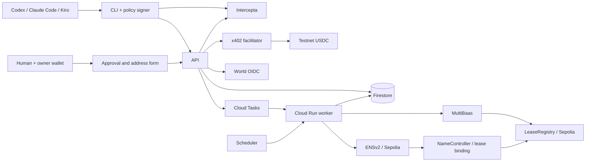

# 技術設計 v2 — GCP / Firestore

ユーザー指定: 郵便関連はWorld人間承認後の「郵便転送可」表示と、人間用の宛先フォームまで。実発送は行わない。

## 1. 構成

TypeScript strict / pnpm workspace。React/Vite静的UI、Fastify API、Firestore Native Standard、request駆動worker。ジョブはFirestore outbox + Cloud Tasks。Solidity + FoundryのLeaseRegistry、viemの署名・receipt処理。T-01で実際に互換性を確認したversionをlockfileへ固定する。

UI/APIは同一Cloud Runサービス、workerは非公開の別Cloud Runサービス。ともにrequest-based / min instances=0。UI/APIは同じHTTPS origin。GCS、GitHub Actions、Tasks/Scheduler、Firestore実装詳細は[インフラ仕様](../../../docs/infrastructure.md)を正とする。3ツールの実利用は共通HTTP/JSON CLIで対応し、MCPを必須にしない。



予定ディレクトリ: apps/web、apps/api、apps/worker、packages/domain、packages/db、packages/integrations/{world,intercepta,x402,multibaas,ens}、packages/agent-cli、contracts、tests/{integration,e2e,live}。

決済chainはBase Sepolia eip155:84532を第一候補。ENSv2とLeaseRegistryはEthereum Sepolia eip155:11155111に統一する。T-00でfacilitator/assetとMultiBaas Sepolia対応を確認。支払い確認からの記録は事業者backendによる証明で、cross-chain proof/bridgeではない。Worldの利用はWorld Chainへのdeployを前提にしない。

## 2. 権限

Agent bearer=アプリ主体、x402=決済、owner wallet署名=契約制御、World=人間認証、明示同意=mail.enable許可。これらは独立して検査する。Worldのみで法的本人確認完了を意味しない。

署名器は顧客側プロセスで秘密鍵とIntercepta keyを環境/OS storeから読む。LLMには操作名と結果だけを渡す。shell全権を持つAgentから鍵を完全隔離する保証はしない。商用では専用署名サービスへ分離する。ハッカソンはテスト用EOAのみ。

初回人間承認では、Leaseのpayerと同じownerWalletを人間がブラウザwalletで署名して証明する。デモでは同じテストEOAをCLI署名器と人間walletに設定する。この証明は技術的制御権であり、実名や法的責任者の証明ではない。

## 3. データモデル

UUID、Firestore Timestamp（APIはUTC ISO 8601）、schemaVersion。金額はAPI/DBとも10進整数文字列、演算はbigint。slotはrepositoryで整数1..65535を検証。FirestoreはSQL CHECK/外部キー/一意制約を提供する前提にしない。以下の「一意」「PK」は論理要件であり、決定的document IDと同一transaction内のguardで実現する。

| Collection | 主なフィールドと論理制約 |
| --- | --- |
| tenants | id, status, termsVersion, termsAcceptedAt |
| agents | id, tenantId, walletChain, walletAddress, name, status; wallet identity一意 |
| api_credentials | id, agentId, secretHash, scopes, expiresAt, revokedAt |
| wallet_challenges | id, purpose, address, chain, domain, nonce, sessionId?, resourceId?, expiresAt, consumedAt |
| buildings | id, publicLabel, postalAddress, addressUseEnabled, policyVersion |
| slots | buildingId, slotNumber, state, heldByOrderId, holdExpiresAt; PK(buildingId,slotNumber) |
| leases | id, tenantId, agentId, ownerWallet, buildingId, slotNumber, status, startsAt, expiresAt, version, chainSyncStatus |
| orders | id, agentId, kind, leaseId?, slotRef?, bodyHash, amountAtomic, network, asset, payTo, expiresAt, status |
| payments | id, orderId 一意, payer, authorizationNonce, payloadHash, status, txHash, settlementEvidence; 一意(network,asset,payer,nonce) |
| idempotency_keys | principalId, method, path, key, bodyHash, resourceId, responseSnapshot; composite 一意 |
| risk_assessments | id, orderId, side, subjectAddress, paymentNetwork, riskNetwork, decision, reasonCodes, responseHash, checkedAt, expiresAt, policyVersion |
| human_bindings | id, leaseId 一意, ownerWallet, encryptedIssuer, encryptedSubject, keyedSubjectHash, createdAt |
| approvals | id, leaseId, agentId, actionHash, nonce, status, expiresAt, authTime, consentAt, bindingId?, appliedAt |
| oidc_sessions | id, approvalId, stateHash 一意, nonceHash, encryptedPkceVerifier, browserSessionId, expiresAt, consumedAt |
| browser_sessions | idHash, ownerWallet?, walletProvedAt?, candidateIssuer?, candidateSubject?, worldAuthTime?, expiresAt |
| mail_profiles | leaseId PK, status, enabledByApprovalId?, grantExpiresAt?, version, encryptedDestination?, destinationConfigured, updatedAt |
| refunds | id, paymentId 一意, amountAtomic, destination, status, txHash?, reason |
| outbox | id, aggregateId, version, eventType, payload, state, availableAt, attempts; 一意(aggregateId,version,eventType) |
| ens_bindings | leaseId 一意, normalizedName 一意, nameNode, labelHash, leaseKey, ownerWallet, resolverAddress, registryAddress, controllerAddress, targetLeaseVersion, syncedLeaseVersion, status, expiry, txHash?, verifiedBlock?, lastErrorCode? |
| chain_cursors | chainId, contract, finalizedBlock, blockHash |
| audit_events | id, actorId, action, resourceId, oldState, newState, traceId, occurredAt, redactedDetails |

すべてのresource参照でtenant/agent/leaseの整合性を検査。slotsとleaseを同一transactionで更新。発行済み(buildingId,slotNumber)は決定的slot documentを残し別leaseに使用不可。renewは同じleaseを更新する。承認はleaseごとに有効なpending/authenticatedを一つとし、approval_headsとversionのtransaction比較で直列化する。uniques、slot_shards、wallet_hold_quotas、rate_limits、daily_purchase_budgets、signer_nonces、chain_submissionsを補助collectionとする。各guardと割当algorithmはインフラ仕様に従う。

Browser sessionはidle 15分/absolute 60分、owner proofは承認時点で10分以内とする。承認適用時とログイン成功時にsession IDをrotateする。API credentialは初期30日有効、登録/失効操作を監査する。新規challengeはIP単位毎分10件、通常Agent APIは毎分60件、未決済区画holdはwallet単位同時3件を初期上限とし、超過は429。settling/reconcilingも上限へ含め、解放目的で消さない。これらはanti-abuseの補助であり、無料wallet作成によるSybil耐性を保証するものではない。

## 4. 住所購入

1. ドメイン・chain・nonce・期限・規約versionを含むwallet challengeを検証してAgent bearer発行。既存walletは同じ主体へ戻す。
2. POST /v1/lease-ordersに冪等キー。Firestore transactionでshard bitmapから空区画を予約し、wallet quota/日次上限/冪等記録/orderを同時作成。価格、30日、asset、payToを固定。
3. executeは所有者と期限を確認し、payloadなしなら402。まだ契約未発行。
4. buyerはInterceptaでpayToをlive判定し、chain/asset/amountと実際のEIP-712全内容を検査。日次予算を原子的に予約して署名。
5. sellerはSDK verify、payer一致、order一致、nonce一意、期限、slot保持を検査し、payerをlive判定。
6. Firestore transactionでsettlingへversion比較更新し、payloadを暗号化保存、slot固定、settlement outboxを保存。commit後にtaskをenqueueして202。workerは送金直前の条件を再検査してsettleする。外部通信をtransaction callbackへ入れない。
7. receipt/Transfer/金額/token/payer/payTo/認可対応と設定finalityを確認。未確定は202。
8. workerのFirestore transactionでpayment=confirmed、lease=active、slot=leased、mail_profile=disabled、quota解放、日次予約の確定消費、outboxを同時保存。以後の同じexecuteは200。chain記録は非同期。

DBとchainが一つのtransactionになると仮定しない。住所の配信は支払い確認後のみ。処理受付202と商品配信は区別し、HTTP終了後のメモリ内settleは行わない。

### 冪等性と復旧

同キー同bodyは同一結果、別bodyは409。キーはprincipal/method/path/bodyHashとともに注文記録の存続期間中保持する。402を最終結果として固定せず、同じ要求へpayment headerを付けて進められる。

settle timeoutはreconciling。txHash、payer/token/nonce、認可消費状態と対応送金を照合。nonce消費だけで成功にしない。同じpayloadの再settleはfacilitatorの冪等性が確認できた場合だけ。新nonceの再課金は禁止。

hold標準10分。payment validBeforeはhold期限以内。settling/reconcilingのslotは時間だけで解放しない。未決済確定なら解放。決済済み契約未発行はreconcilerが発行を回復し、不可能ならrefund_pendingとする。返金は元payerへの別送金を記録。

finality前のreorgは保留、確認後のreorg検知はsuspendedと運用通知。再課金しない。期限内renewは旧期限+30日、expiredからは確定時点+30日。suspended/revokedはAgentがrenewで解除できない。

## 5. World承認→フォーム

1. Agentが POST /v1/leases/{id}/mail-approval を実行。scope=mail.enable、固定actionHash、10分期限のApprovalと人間用URLを返す。enabledなら既存profileを返す。
2. 人間が /approve/{approvalId} を開くとanonymous browser sessionを作る。URLだけでは契約の非公開情報を見せない。人間が接続したwalletの署名を検証してownerWallet一致を確認する。challengeはpurpose=mail.owner、approvalId、sessionId、domain、chain、nonce、期限で束縛。
3. 対象Agent/Lease、権限の意味を表示しWorld認証開始。serverがstate/nonce/PKCEを生成しapprovalとbrowser sessionへ束縛する。
4. callbackで署名/issuer/audience/nonce/時刻を検証し、prompt=login・max_age=0に対応したfreshnessを確認。auth_timeは開始時刻以降、許容clock skew最大30秒。既存bindingがあれば(iss,sub)一致必須。初回はcandidateとしてsessionへ保存し、まだbindingを作らない。
5. 人間に「郵便転送設定を有効にする」を再表示。CSRF付きapprove POSTでactionHash、owner proof、World freshness（5分以内）、Approval期限、Lease有効性、policyを再検査する。
6. 一つのDB transactionで初回binding確定、Approval=applied、MailProfile=enabled、grantExpiresAt=現在のlease.expiresAtにする。World認証だけではenabledにしない。二回目の同一承認は同じ結果を返す。
7. UIに「郵便転送可」「転送先未登録」と人間用フォームを表示。recipient、郵便番号、都道府県、市区町村、番地、任意建物名を本人が入力する。
8. PUT /v1/leases/{id}/mail-destination は人間sessionのみ受理。ownerWalletとWorld binding、enabled権限、有効契約、CSRF、expectedVersionを検査して暗号化保存。成功後「転送先登録済み」を表示。実発送・送料決済は発生させない。
9. AgentのGETはstatusとdestinationConfiguredのみ返す。人間のGETだけ転送先を復号。再編集は同じwallet+World認証の新sessionを確立できるよう、別Approvalで同一scopeを再承認する。既存bindingを変えない。
10. 人間のdisable操作は権限を取り消す。lease期限切れでもenabledを有効として返さない。renew後は再承認が必要。保存済み住所はdisabled中にAgentへ返さず、人間の再承認後のみ表示する。

actionHash=SHA-256(JCS({schemaVersion, action:'mail.enable', leaseId, leaseVersion, agentId, ownerWallet, policyVersion, nonce, expiresAt}))。

この承認は宛先フォームの設定権限であり、個々の郵便の転送同意ではない。承認時点に存在しない宛先を承認済みの発送先として扱わない。将来発送を追加する場合は別の宛先・料金・郵便ごとの操作承認を設計する。

## 6. 状態

| 対象 | 遷移 |
| --- | --- |
| Slot | available → held → leased → retired。未決済確定したholdのみavailableへ戻す |
| Order | awaiting_payment → settling → fulfilled。settling → reconciling → fulfilled / failed_unpaid / refund_pending。awaiting_payment → expired / cancelled / blocked |
| Payment | prepared → settling → confirmed。settling → unknown → confirmed / failed。confirmed → refund_pending → refunded |
| Lease | active → expired / suspended / revoked。expiredはrenewでactive可 |
| Approval | pending → authenticated → applied。pending/authenticated → denied / expired / cancelled |
| MailProfile | disabled → enabled（appliedのみ）。enabled → disabled（人間取消）/ suspended（契約停止・期限切れ） |

effective mail statusは毎要求でlease有効期限と照合し、cron遅延でもenabledを返さない。expired→renew後はprofileをdisabledへ戻し新承認を要求する。契約version変更は未適用approvalを失効させるが、期限内renewによる既存grantは元grant期間まで有効とする。profileにgrantExpiresAtを保持しlease期限以上へ自動延長しない。

## 7. LeaseRegistry

住所利用サービスの証明であり不動産所有権ではない。DB契約を利用可否の正とし、chainは事業者発行の期間付き記録。オンチェーン転送機能はない。

```solidity
// 実装予定interface。コンパイル済みではない。
function recordLease(bytes32 leaseKey, bytes32 buildingKey, uint16 slot,
    bytes32 holderCommitment, uint64 expiresAt, uint64 version) external;
function revokeLease(bytes32 leaseKey, uint64 version) external;
function getLease(bytes32 leaseKey) external view returns
    (bytes32 buildingKey, uint16 slot, bytes32 holderCommitment,
     uint64 expiresAt, uint64 version, bool revoked);
```

leaseKey/buildingKeyはランダム32byte、holderCommitmentはkeccak256(abi.encode(ownerWallet, holderSalt))。saltはDBで生成するがENS binding検証時に公開となるため匿名性を保証しない。World subject/住所hash/個人metadata URIは記録しない。WRITER_ROLEのみ更新、adminのみrole管理。slot!=0、version単調増加、同じbuilding/slot二重登録不可。renewでholder/slotを変更できない。

同version同内容は冪等、同version別内容はrevert。revoked解除不可。pauseはwrite停止、read可。資金を預からない。LeaseRecorded/LeaseRevokedを発行しMultiBaas経由でwrite/read/event照会する。writeはdeploymentの署名方式によるが、少なくともread/event同期はlive MultiBaasを使用。

webhookは任意。署名が検証できない通知は再照会トリガーのみ。pollで補完し(chain,txHash,logIndex)を重複排除、blockHash/cursorでreorg回復する。

## 8. UIと非機能

Agent dashboard: 住所/期限、risk/決済履歴、chain同期、転送可/不可、宛先登録有無。Human page: wallet proof → World認証 → 明示承認 → 国内住所フォーム。日本語を基本に審査用英語ラベルを併記。

sandbox proof/testnetと「実際の郵便転送は行いません」を常時明示。pendingを成功に見せない。転送先はモデル出力、普通のログ、chain、Agent responseへ出さない。フォーム入力はplain textとして保存・escapeし、命令やHTMLとして実行しない。

## 9. ENSv2連携

[ENSv2詳細設計](../../../docs/ensv2.md)を正とする。支払い確定→LeaseRegistry同期→契約別ENS登録→Universal Resolver read-backの順。独立したensStatusを持ち、失敗しても二重請求しない。

公開recordsは契約pointerとAgent説明まで。本人の転送先は従来通りDB暗号化保存し、ENSへ書き出さない。名前で住所契約を取得するAPIもAgentの所有者認可を保持する。UserRegistryは事業者管理、Resolverは契約ごとに分離する。
