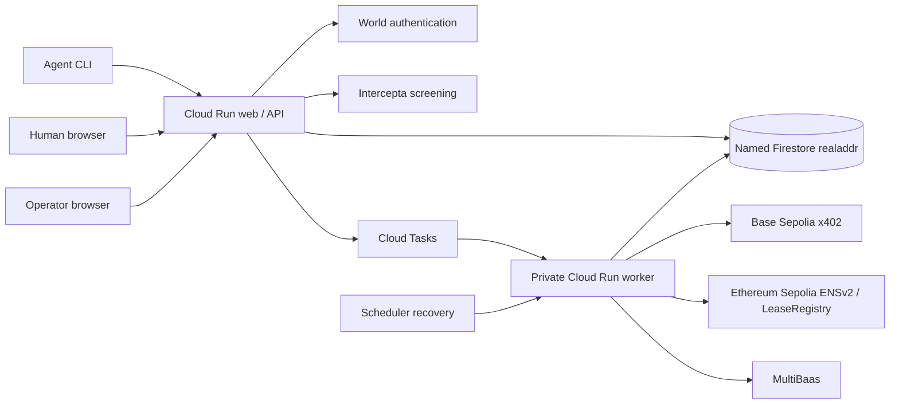

# Architecture

[English index](README.md) · [Project overview](../../README.en.md) · [Current status](implementation-status.md)

This is a reader-facing English guide. [Requirements (Japanese)](../../.kiro/specs/realaddr/requirements.md) define behavior, [design (Japanese)](../../.kiro/specs/realaddr/design.md) defines implementation, and [public OpenAPI](../openapi.json) defines HTTP shapes. The connected architecture below is the target; deployed components do not imply the entire flow is operational.

## Components

| Component | Responsibility |
| --- | --- |
| `apps/web` | React/Vite UI, generated crawlable public HTML, account, human-approval and operator screens |
| `apps/api` | Fastify API, server-side authorization, configuration validation and authenticated routes |
| `apps/worker` | Private HTTP execution, persistent claims/retries and reconciliation |
| `packages/domain` | Domain contracts, pricing, validation and state boundaries |
| `packages/db` | Firestore repositories, atomic state transitions and uniqueness guards |
| `packages/agent-cli` | Shared interface for Codex, Claude Code and Kiro |
| `packages/world` | OIDC validation and human authentication support |
| `packages/intercepta` | Real-response normalization and fail-closed screening |
| `packages/ens` | ENSv2 hierarchy, registration/binding validation and lifecycle |
| `contracts` | LeaseRegistry, NameController and resolver implementation |
| `infra` | Separate bootstrap/application Terraform roots |

Public pages return readable initial HTML and public discovery assets. Private account/admin content must never enter public HTML or AEO assets. White/light-gray surfaces and restrained blue accents share status components that explicitly distinguish pending, successful and failed operations. See [frontend (Japanese)](../frontend.md) and [AEO (Japanese)](../aeo.md).

[Local setup](../../README.en.md#run-locally) covers Windows PowerShell, WSL bash and macOS zsh/bash. The pnpm command contract is shared, but WSL must use its own Linux toolchain and dependencies rather than Windows `node_modules`. Recorded Windows execution and Linux CI are distinct from unverified manual WSL/macOS startup.

## Durable state and effects

Locations have virtual slots 1–65,535, never physical floors. Allocation uses sharded bitmap state with slot records created when needed. Transactions enforce exclusive holds/leases, tenant scope, payment uniqueness, canonical name reservations, single approval application and destination-version conflicts.

Payment uncertainty is durable: do not release the slot or settle again as though no payment occurred. Workers persist execution claims, attempts and retry/outbox jobs, then reconcile external outcomes before retrying. External requests and chain transactions run outside retried Firestore transaction callbacks. A confirmed receipt authorizes fulfillment; admin actions and client state cannot manufacture payment confirmation.

Runtime uses named database `realaddr`, failing closed if it is missing/unreachable. `(default)` is only a shared historical/ownership reference. Every collection, including admin, guard and outbox collections, uses `realaddr_event_`; resource names use `realaddr-event`. Prefixes are not an IAM boundary. Runtime IAM and deny-all client Rules are separate gates. The database uses delete protection and Terraform `prevent_destroy`.

The shared project requires fresh ownership inventory before resource creation or changes. Web, worker, Tasks and Scheduler identities are separate dedicated accounts. The protected `DEPLOY_SERVICE_ACCOUNT` has an externally managed lifecycle; preserve other bindings and use only reviewed additive grants and repository-restricted WIF. App Terraform must not manage shared database/rules/indexes, project IAM/API/budgets wholesale or service-account keys. See [infrastructure (Japanese)](../infrastructure.md).

## Authorization boundaries

Agent credentials are wallet-authenticated and scoped to tenant/agent ownership. They permit defined reads and agent operations, never human approval or full forwarding-address access.

Human mail operations need owner-wallet proof, fresh World authentication and explicit approval for a fixed request. OIDC authentication is not consent or legal KYC. Pending approval expires quickly; applied consent persists for the unchanged destination. Paid lease status governs effective eligibility separately: expiry suspends it while retaining consent, and confirmed same-lease renewal/revival restores it. Destination changes need fresh version-bound approval consumed atomically with the write. Renewal cannot bypass human disable or security suspension.

Operators use Google OIDC and a separate allowlisted session. They can manage permitted locations and operational summaries, but cannot substitute for human consent, view full destinations or mark payments successful. Server authorization enforces all boundaries; UI controls and prompts do not. See [admin (Japanese)](../admin.md) and [World (Japanese)](../world.md).

## Chain and ENS contract

Payments use Base Sepolia; ENSv2 and lease attestations use Ethereum Sepolia. Backend-confirmed payments are the operator's basis for issuance, not a cross-chain cryptographic payment proof. No bridge or additional payment chain is included, and mainnet operation is disabled.

Address rental/renewal costs 0.55 USDC per 30 days in testnet/dev. ENS standard/custom initial add-ons cost 0.10/0.30 USDC respectively; custom replaces the standard tier. Future mainnet prices are 55/10/30 USDC. Six decimals and matching network/asset/price profile are mandatory; missing/mismatched configuration closes sales.

ENS is optional for a lease but required for the submission demo. Reserve the canonical name atomically with a frozen quote; retain reservations during uncertain payment and never reuse paid names for another lease. Address purchase alone does not register a name. Purchased ENS maintenance is included in address renewals, with no retry or same-lease recovery charge.

The actual hierarchy is parent → location registry → purchased lease name, with a dedicated resolver per add-on. Standard names use `f00042.<location-slug>.<parent>.eth`. Exact registration, controller binding, lease state and expiry must agree; a text record alone is insufficient. Forwarding destinations and World identifiers stay off ENS. See [ENSv2 (Japanese)](../ensv2.md) and [pricing (Japanese)](../pricing.md).

## Completion gate

Submission needs one real screening → address payment → lease/MultiBaas read → separate ENS quote/payment → issuance/official resolution → World approval → human destination save/read flow. Representative denials, persistence/recovery and short common-CLI checks across all three tools accompany it. Fixtures, unsigned plans and infrastructure deployment prove only their own scope. See [acceptance (Japanese)](../acceptance.md) and [status](implementation-status.md).
