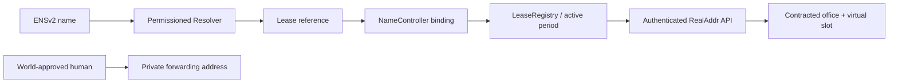

# ENSv2と住所契約の紐づけ — 採用設計

更新: 2026-09-25。**実装可能と判断し、初回リリースの必須スコープへ追加する。** 現時点は設計・API契約であり、親ENS名取得、コントラクトdeploy、実名前解決は未実施。

## 1. 使い方

住所契約ごとに `tokyo-v00042.<parent>.eth` のような名前を発行する。`<parent>.eth`は事業者がSepoliaで取得・制御するENSv2名で、`realaddr.eth`の取得可能性は未確認。名前は「このAgentが持つ住所契約」を指す。支払い用アドレスの代わりに物理住所をaddr recordへ入れる設計にはしない。



Agentは名前から契約を見つけ、自分の資格情報で契約住所を取得できる。公開lookupでは契約参照と検証状態だけを返す。人間が入力する転送先・World ID情報・転送設定状態はENSへ公開しない。

## 2. 選択肢と採用理由

| 方式 | 評価 | 判断 |
| --- | --- | --- |
| 事業者の親名から契約別サブネームを発行 | 期限・取消・編集範囲を住所契約と揃えられる | **P0採用** |
| 利用者が持つ既存ENS名を別名として紐付け | 既存identityを使えるが所有権変更の監視が必要 | P1。下記設計を参照 |
| 親resolverのwildcardだけで全区画を仮想解決 | deploy数は減るが個別の編集権限分離が複雑 | 今回は採用しない |
| 住所全文をENS textへ直接書く | 公開・永続となり修正や非公開化に制約 | 不採用。公開許可した営業所住所はAPI/UIに限定 |

ENSv2の階層registry、期限付きサブネーム、キー単位権限をプロダクトに使用する。単に既存ENS名を画面へ表示するだけにしない。対象賞は「Best Use of ENSv2」。公式条件ではSepolia上の実動作・公開コード・live demoが求められる。[賞の条件](https://ethglobal.com/events/tokyo2026/prizes)

## 3. chainと信頼モデル

- ENSv2: Ethereum Sepolia `eip155:11155111`。公式beta deploymentへ接続する。[公式概要](https://docs.ens.domains/ensv2/overview/)
- LeaseRegistry、RealAddrNameController、事業者UserRegistry、契約別Permissioned ResolverもSepoliaへ配置する。
- x402決済は引き続きBase Sepolia `eip155:84532`を第一候補とし、名前発行のために二度支払わせない。事業者がSepoliaのgasを負担する。
- backendが確認した支払いから契約を発行する構成で、チェーン間支払いproofやbridgeを実装するものではない。第三者に対しては「事業者が発行した利用権の証明」と説明する。
- MultiBaasのSepolia利用権限をT-00で確認する。未確認ならblockerを記録し、ENSを独自テストchainへ置換して完成扱いしない。
- 親名の有効期限は発行する全子名より長く保つ。親の残存期間が不足すると新規発行・更新を保留し事業者更新を要求する。

## 4. 名前・識別子

v1は自由入力ではなく、設定された拠点slug + `-v` + 5桁区画番号。例 `tokyo-v00001`〜`tokyo-v65535`。拠点slugはlowercase ASCII、親名と合わせてENSIP-15正規化し、label length・DNS encodingをSDKで検証する。

一つのleaseに一つのcanonical名。名前と区画を別利用者へ再利用しない。leaseはランダムleaseKeyで参照し、API内部UUIDを公開recordへ入れない。namehash、registryアドレス、labelhash、leaseKeyを識別子とし、更新で変わりうるERC1155 tokenIdを永続主キーにしない。

## 5. 公開record

以下の `realaddr.*` は本アプリ独自のENS text keyであり、ENSの標準キーを主張しない。

| record | 値・責任 |
| --- | --- |
| addr / coin type 60 | AgentのownerWallet。物理住所でもx402の事業者payToでもない |
| realaddr.schema | `1` |
| realaddr.lease | `eip155:11155111:<LeaseRegistry address>:<bytes32 leaseKey>`。独自pointer構文 |
| realaddr.binding | SepoliaのRealAddrNameController address |
| realaddr.api | 固定HTTPS service origin。読み手はallowlistとの一致を要求 |
| description | Agentが更新できる公開説明、plain text、最大280文字 |

住所の全文、転送先、そのhash、World subject、JWT、承認URL、Agent API tokenはrecordに入れない。`active=true`のtextを信用して認可しない。現在の状態はregistry/LeaseRegistry/DBの整合性で判断する。

所有wallet・名前・契約参照は公開され、同じAgentの活動が結び付く。これを購入planと規約に表示する。匿名性や登録履歴の完全削除は保証しない。オンチェーン書き込み前の明示的なplan説明は必要だが、基本住所購入に新たなWorld認証は加えない。

ENSIP-26の `agent-context`、`agent-endpoint[web]` はP1追加候補。現時点はdraftであるため、実装していないMCP/A2A endpointを登録しない。[Agent Text Records](https://docs.ens.domains/ensip/26/)

## 6. 権限分離

**一契約に一つのPermissioned Resolver instance**を使う。生成は契約成立時だけ行い、65,535個を事前deployしない。ENSのfactory/implementationを利用し、独自のresolver protocolを作らない。

| 主体 | 与える権限 | 与えない権限 |
| --- | --- | --- |
| 顧客Agent/owner wallet | 当該専用resolverのdescription key setter | realaddr.*、addr、link、upgrade、name transfer、registry renew |
| NameController | UserRegistryのregister/renew/unregister、契約recordの更新、Agent委任の管理 | 顧客の支払い署名鍵 |
| 事業者admin | 初期設定、緊急停止、親名管理。秘密は通常APIから分離 | World認証を偽装する権限 |

registry登録ownerはlease.ownerWallet、初期owner roleBitmapは0を基本とする。registryとresolverのroleは別なので、description委任はresolver側で明示する。UserRegistryのroot権限はcontroller/adminに限定し、全ownerにadmin bitmapを配らない。

名前は事業者管理の非譲渡設定。顧客へtransfer admin・resolver差し替え・subregistry差し替えを渡さない。事業者が取消可能な名前であり、emancipated/permanent所有とは説明しない。確定ABIに対する実transfer拒否をA-30で証明する。

公式Resolverはsetterのキーによる権限で、名前ごとの隔離は同一instance内では効かない。shared resolverに全Agentを登録してはならない。[Permissioned Resolver](https://docs.ens.domains/ensv2/permissioned-resolver/)

## 7. 発行・更新・失効

1. x402決済確定後、DB契約とoutboxを作る。住所利用は開始でき、ENS表示は`pending`。ENS未発行を理由に再課金しない。
2. LeaseRegistryがSepoliaで確定してから、契約別resolverをfactoryで作成する。再送では既存deployment/receiptを照合し、重複deployを防ぐ。
3. NameControllerが事業者UserRegistryへ登録し、固定record・description委任・bindingを設定する。controller内で可能な処理を一transactionにまとめ、途中状態はreadyにしない。
4. receipt/finality確認後に公式Universal Resolver経由でread-backし、親階層、exactな子名、owner、resolver、leaseKey、期限が一致したら`ready`。
5. renewは先にLeaseRegistryを更新し、そのversion/期限をcontrollerが読み検証して名前を延長する。子名期限は親期限とlease期限の小さい方以下。同時更新はlease versionで整列し古いjobをskipする。
6. expiryでは名前の登録有効期限と契約期限の両方を検査。workerが止まっていても時刻超過をactiveと返さない。
7. suspend/revokeはDBで即時にサービス認可を止め、outboxでcontroller.disableNameを呼び名前を無効化する。revokeはLeaseRegistry.revokeLeaseも実行する。未確定の間はpublic APIでも`pending`/`invalid`、決してverified activeにしない。chainのみの第三者確認には同期遅延があると表示する。停止済みbindingを通常renewで再有効化しない。
8. 停止時はdescription委任も解除する。resolverへ直接読みに行くと過去データが残る場合があるため、直接text readだけを現在の利用権証明としない。
9. 期限切れrenewは同じ主体・同じ名前だけ復活可。取消済みleaseは復活不可。registryの再登録が必要な場合は新token versionに更新し、権限を最小構成から付け直す。

親名失効、親pointer変更、reorg、record改変、unknown txはreconciler対象。復旧で同じname/leaseKey/versionを維持する。`ready`はDB boolだけで判定せず実read-back証跡を持つ。

## 8. NameControllerの内部契約

以下は本アプリ独自の予定interface。ENS公式ABIではない。

```solidity
function bindLease(bytes32 leaseKey, bytes32 buildingKey, uint16 slot,
    address owner, bytes32 holderSalt, address resolver, uint64 leaseVersion) external;
function syncLease(bytes32 nameNode, uint64 leaseVersion) external;
function disableName(bytes32 nameNode, uint64 leaseVersion) external;
function getBinding(bytes32 nameNode) external view returns
    (bytes32 leaseKey, address owner, address resolver,
     uint64 leaseVersion, bool disabled);
```

controllerにnamespace、拠点slug、LeaseRegistry、UserRegistryを固定する。label/FQDNはcontrollerが設定とslotから決め、外部の自由なnameNodeを登録しない。すべてのwriteは事業者のPUBLISHER_ROLEのみ。leaseのbuilding/slot/holderCommitment/期限/versionを照合する。

既存LeaseRegistryに保存するholderCommitmentは、オンチェーン検証可能な`keccak256(abi.encode(ownerWallet, holderSalt))`に統一する。holderSaltをDBで生成し、binding呼び出しで照合する。saltはこの時点で公開になるため、秘匿の根拠として扱わない。

同じname/lease/versionは冪等、別leaseや別ownerへの置換は拒否する。approved resolver/factory由来を確認し、想定外のresolverを渡せない。bindingには独立した一意制約を置き、一般利用者のtext書込で変更できない。

## 9. 名前を使うときの検証

`resolve(name)`は次を満たしたときだけ`verified`とする。

1. ENSIP-15正規化、Sepoliaの公式Universal Resolverを使用。親名suffixの文字列一致だけでは信用しない。
2. rootからの正規階層が期待するUserRegistryへ繋がり、**exactな子名登録**が有効。祖先ownerやwildcard fallbackだけでは不可。
3. resolver instanceとcontroller binding、事業者固定contract addressが一致する。
4. leaseKey、owner、version、期限がLeaseRegistryと一致しactive、DB契約も有効。
5. DBとchainのどちらかが停止・不明・同期遅延なら`pending`または`invalid`。住所利用の認可は既存API資格情報とDB状態で行う。

正規化前後の値をUIで明示し、第三者の偽サブネーム・偽契約pointer・古いキャッシュを拒否。cached結果は最大30秒かつname/parent/leaseの残存期限以下。課金や権限変更はキャッシュだけを根拠にしない。

Resolverの`realaddr.api`やagent記述は未信頼入力として扱う。任意URLへcredentialを送らず、サーバーから勝手にfetchしない。取得済みENS名はWorld承認やIntercepta判定を省略する理由にならない。

## 10. APIとCLI

- `GET /v1/ens/resolve?name=...`: public、rate limited。binding検証結果と契約参照のみ。営業所住所・転送先・World情報・内部lease UUIDは返さない。
- `GET /v1/subscriptions/by-ens?name=...`: Agent認証。上記検証後、所有者が一致した場合だけ既存Subscription response（契約した営業所住所付き）を返す。他者は404。
- `GET /v1/subscriptions/{subscriptionId}/ens`: owner Agent。発行/同期状態を取得。
- `POST /v1/subscriptions/{subscriptionId}/ens-description-transaction`: owner Agentが更新する説明文の**unsigned transaction**を準備するendpointとし、HTTP保存で成功扱いしない。bodyと冪等キーに対応するto/data/chainIdを返す。Agentの専用署名器がSepoliaで署名・送信し、receiptとread-back後にCLIが完了報告する。

HTTPの`subscriptionId`は内部`leaseId`と同じUUID。ENS binding、controller、actionHashで参照する内部leaseKey/leaseIdと混同しない。公開resolve応答に内部UUIDを含めない。
- CLI: `ens status --subscription`、`ens resolve --name`、`lease status --name`、`ens describe --subscription --text`。transfer/update権限は実コントラクトで検査する。

description用のtxは代金の支払いではなく、テストETH gasのみ。送信先resolver、function、DNS name、key=description、文字数、gas上限を署名器が固定検査する。x402支出上限を無効にしてgeneric arbitrary txを許可しない。

## 11. 既存ENS名の紐づけ（P1、今回は必須外）

所有する`my-agent.eth`等を別名として使うことも可能。nonce、chain、canonical名、leaseKey、有効期限を含むchallengeに**exact owner**が署名し、現在のownerもchainで検査する。addrが同じだけでは所有権証明にしない。ENSv1名を取り込むだけではENSv2賞対応の代替にならない。

利用者のresolverへ独自pointerを書いてもらい、正方向/逆方向のbindingを照合する。名前移転・resolver変更・期限切れでaliasを無効化し、canonical契約名は維持する。任意の共有resolverに事業者の全root権限を要求しない。v1ではこのP1機能のrouteや成功表示を提供しない。

## 12. 実装前に確定するもの

親名の取得と制御、公式deployment/ABI/commit、viem等の対応version、MultiBaas Sepolia、test ETH、role設定、親resolverのfallback挙動をT-00/T-12で検証する。ベータのinterfaceが変わった場合はpinを更新し、影響する登録/解決/権限の代表ケースだけを再確認する。[最小チェック](acceptance.md)を基準にし、変更と無関係な全契約テストは繰り返さない。具体的contract addressや使用可能な親名を推測で埋めない。
