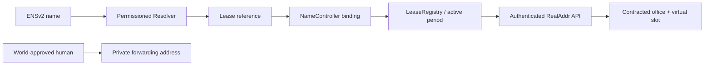

# ENSv2と住所契約の紐づけ — 採用設計

更新: 2026-09-26。ENSv2機能の実装・Sepolia接続とデモ検証は初回リリースの対象とするが、利用者への名前発行は希望者だけが初回追加料金を支払う任意オプション。住所契約だけで利用できる。現時点は設計・API契約であり、親ENS名取得、コントラクトdeploy、実名前解決は未実施。料金境界は[pricing.md](pricing.md)に従う。

## 1. 使い方

ENSオプションを購入した住所契約ごとに、標準名`f00042.<location-slug>.<parent>.eth`、または希望したカスタム名`<custom-label>.<location-slug>.<parent>.eth`を一つ発行する。未購入の契約はENS status=`not_purchased`であり、名前・resolverのdeploy/発行jobを作らない。`<parent>.eth`は事業者がSepoliaで取得・制御するENSv2名で、取得可能性は未確認。名前は「このAgentが持つ住所契約」を指す。支払い用アドレスの代わりに物理住所をaddr recordへ入れる設計にはしない。



Agentは名前から契約を見つけ、自分の資格情報で契約住所を取得できる。公開lookupでは契約参照と検証状態だけを返す。人間が入力する転送先・World ID情報・転送設定状態はENSへ公開しない。

## 2. 選択肢と採用理由

| 方式 | 評価 | 判断 |
| --- | --- | --- |
| 希望者の契約へ事業者親名→拠点名→契約名の階層でサブネームを発行 | 拠点ごとのnamespaceと契約の期限・取消・編集範囲を分離できる | **P0の任意有料オプションとして採用** |
| 利用者が持つ既存ENS名を別名として紐付け | 既存identityを使えるが所有権変更の監視が必要 | P1。下記設計を参照 |
| 親resolverのwildcardだけで全区画を仮想解決 | deploy数は減るが個別の編集権限分離が複雑 | 今回は採用しない |
| 住所全文をENS textへ直接書く | 公開・永続となり修正や非公開化に制約 | 不採用。公開許可した営業所住所はAPI/UIに限定 |

ENSv2の階層registry、期限付きサブネーム、キー単位権限をプロダクトに使用する。単に既存ENS名を画面へ表示するだけにしない。対象賞は「Best Use of ENSv2」。公式条件ではSepolia上の実動作・公開コード・live demoが求められる。[賞の条件](https://ethglobal.com/events/tokyo2026/prizes)

拠点ごとの中間namespaceは`ens_namespaces/{buildingId}`で`parentName`、`locationSlug`、`upperRegistry`、`locationRegistry`、`namespaceName`、`expiresAt`、`status`を記録する。親名→拠点名の登録・subregistry pointer・期限をreceiptと公式解決で確認してから、その拠点の標準/カスタム契約名を販売する。各拠点UserRegistryのdeploy、親の上位registryへの中間登録、更新は拠点ごとの実chain操作であり、単にFQDNへdotを足す実装ではない。

## 3. chainと信頼モデル

- ENSv2: Ethereum Sepolia `eip155:11155111`。公式beta deploymentへ接続する。[公式概要](https://docs.ens.domains/ensv2/overview/)
- LeaseRegistry、RealAddrNameController、事業者上位UserRegistry、拠点別UserRegistry、契約別Permissioned ResolverもSepoliaへ配置する。親`.eth`のsubregistry pointerを上位registryへ向け、上位registryに拠点labelを実登録して各拠点UserRegistryへ接続する。拠点labelは単なるFQDN文字列の挿入ではない。
- 住所料金と初回ENS追加料金のx402決済はBase Sepolia `eip155:84532`を使用する。ENS追加料金は一leaseにつき初回購入時だけ請求し、その後の住所更新料金に既購入ENSの維持を含める。技術的な再送・再同期では再課金しない。事業者がSepoliaの発行・維持gasを負担する。
- backendが確認した支払いから契約を発行する構成で、チェーン間支払いproofやbridgeを実装するものではない。第三者に対しては「事業者が発行した利用権の証明」と説明する。
- MultiBaasのSepolia利用権限をT-00で確認する。未確認ならblockerを記録し、ENSを独自テストchainへ置換して完成扱いしない。
- 親名・拠点名の有効期限は発行する契約名より長く保つ。親または拠点名の残存期間が不足すると新規販売・発行・更新を保留し事業者更新を要求する。拠点の中間登録、registry deploy/接続、更新にもSepolia gasが必要であり、名前販売前に正しい階層を確認する。

## 4. 名前・識別子

標準labelは仮想区画番号を5桁にゼロ埋めした`f00001`〜`f65535`で、標準FQDNは`f00042.<location-slug>.<parent>.eth`。拠点slugは登録後不変の1〜63文字のlowercase ASCII DNS labelとし、先頭・末尾は英数字、内部だけハイフンを許す。ENSIP-15正規化後も同一labelであることを確認して上位registryへexact登録する。日本語を含められる拠点displayNameとは別物。カスタムlabelは同じ拠点名の下に一つ指定できる。ASCII小文字英数字を先頭・末尾とし、内部だけハイフンを許す3〜32文字のDNS labelに限る。dotや別拠点・別親名の入力を許さない。APIはlowercase入力だけを受理してENSIP-15正規化とlabel長・DNS encodingをSDKで検査し、正規化結果が期待する単一labelと一致しなければ拒否する。UI/CLIが小文字化する場合は送信前にcanonical完全名を明示する。

`^f[0-9]+$`に一致するlabelは桁数や区画範囲にかかわらず標準用namespaceとして全予約し、カスタムには販売しない。初期`namePolicyVersion=1`のサービス予約labelは正確に`admin`、`api`、`www`の3つとし、API見積とNameControllerは同じ固定policyで検証する。v1に管理UIからの予約語編集はない。将来のpolicy変更は新規見積にだけ適用し、支払済みの見積snapshotに固定した旧version/nameを遡って拒否・改名・再課金しない。標準・カスタムとも同じ拠点registry内で重複を拒否する。

一つのleaseに一つのcanonical名。ENS追加見積には`nameType=floor|custom`、canonical label、拠点slug、親名、正規化済みFQDN、blocklist version、価格を固定する。購入済み名のrename・2つ目の名前はv1対象外。支払済み・発行済みの名前は別leaseへ再利用しない。v1では区画も一度割り当てた後、別leaseへ再利用しない。leaseはランダムleaseKeyで参照し、API内部UUIDを公開recordへ入れない。namehash、上位/拠点registryアドレス、labelhash、leaseKeyを識別子とし、更新で変わりうるERC1155 tokenIdを永続主キーにしない。

## 5. 公開record

以下の `realaddr.*` は本アプリ独自のENS text keyであり、ENSの標準キーを主張しない。

| record | 値・責任 |
| --- | --- |
| addr / coin type 60 | AgentのownerWallet。物理住所でもx402の事業者payToでもない |
| realaddr.schema | `1` |
| realaddr.lease | `eip155:11155111:<LeaseRegistry address>:<bytes32 leaseKey>`。独自pointer構文 |
| realaddr.binding | SepoliaのRealAddrNameController address |
| realaddr.api | 固定HTTPS service origin。読み手はallowlistとの一致を要求 |
| description | Agentが更新できる公開説明、plain text、最大280文字 |

住所の全文、転送先、そのhash、World subject、JWT、承認URL、Agent API tokenはrecordに入れない。`active=true`のtextを信用して認可しない。現在の状態はregistry/LeaseRegistry/DBの整合性で判断する。

所有wallet・名前・契約参照は公開され、同じAgentの活動が結び付く。ENS追加オプションの購入前にplanと規約で表示する。匿名性や登録履歴の完全削除は保証しない。オンチェーン書き込み前の明示的なplan説明は必要だが、基本住所購入にENS・World認証を加えない。

ENSIP-26の `agent-context`、`agent-endpoint[web]` はP1追加候補。現時点はdraftであるため、実装していないMCP/A2A endpointを登録しない。[Agent Text Records](https://docs.ens.domains/ensip/26/)

## 6. 権限分離

**ENS購入済みの一契約に一つのPermissioned Resolver instance**を使う。生成は初回追加料金の支払確定後だけ行い、住所契約成立時や65,535区画分の事前deployはしない。ENSのfactory/implementationを利用し、独自のresolver protocolを作らない。

| 主体 | 与える権限 | 与えない権限 |
| --- | --- | --- |
| 顧客Agent/owner wallet | 当該専用resolverのdescription key setter | realaddr.*、addr、link、upgrade、name transfer、registry renew |
| NameController | 拠点別UserRegistryのregister/renew/unregister、契約recordの更新、Agent委任の管理 | 顧客の支払い署名鍵 |
| 事業者admin | 上位・拠点registryの初期接続、緊急停止、親名管理。秘密は通常APIから分離 | World認証を偽装する権限 |

registry登録ownerはlease.ownerWallet、初期owner roleBitmapは0を基本とする。registryとresolverのroleは別なので、description委任はresolver側で明示する。UserRegistryのroot権限はcontroller/adminに限定し、全ownerにadmin bitmapを配らない。

名前は事業者管理の非譲渡設定。顧客へtransfer admin・resolver差し替え・subregistry差し替えを渡さない。事業者が取消可能な名前であり、emancipated/permanent所有とは説明しない。確定ABIに対する実transfer拒否をA-30で証明する。

公式Resolverはsetterのキーによる権限で、名前ごとの隔離は同一instance内では効かない。shared resolverに全Agentを登録してはならない。[Permissioned Resolver](https://docs.ens.domains/ensv2/permissioned-resolver/)

## 7. 発行・更新・失効

1. 住所用x402決済が確定したらDB契約を作り、ENSは`not_purchased`のまま住所利用を開始する。LeaseRegistryへの記録はENS購入の有無にかかわらず全契約へ従来通り実行する。ENS用resolver deploy/名前発行jobは作らない。
2. owner Agentが有効な自分のleaseについて`POST /v1/payment-intents`に`kind=ens_addon`、`subscriptionId`、`nameType=floor`（省略時）または`nameType=custom`と`customLabel`を送り、初回ENS追加の固定見積・区別されたx402 intentを作る。見積には正規化済みFQDNと選択した標準/カスタム販売価格をsnapshotし、支払い前にそのFQDNの決定的guardを予約する。見積期限は10分後とlease期限の早い方。新slot holdと新規lease日次quotaは使わない。価格設定の欠落・不一致、親名/拠点名の残存期限不足、上位・拠点registry/controller等の発行設定不備なら販売を停止し、支払い可能な402を返さない。payer一致、Intercepta判定、金額/network/asset確認、冪等性、結果不明の照合は住所購入と同じ安全条件を適用する。不明送金を見積期限だけで未払いに戻したり名前guardを解放したりしない。未払いが確定した場合だけ予約guardを解放する。
3. `ens_entitlements/{leaseId}`で`pending_payment → paid → refund_pending → refunded`を管理し、`intentId`、確定した`paidPaymentId`/`paidAt`、`pricingVersion`、`version`、`nameType`、label、正規化済みFQDN、`namePolicyVersion`を保持する。ENS追加料金の決済確定と同じDB transactionでentitlementを一回だけ`paid`へ変え、名前guardをそのleaseへ永続固定し、発行outboxも必ず保存する。予約中のguardは未払い確定時のみ解放し、支払済み・発行済みのcanonical FQDNは別leaseへ再利用しない。settle後にleaseが停止・期限切れと判明した場合はoutboxをblockedにして`paid`を維持し、発行を保留する。同じleaseが更新され有効になった後に同じjobを再開する。発行結果不明・再試行可能な障害は照合を続け、返金を開始しない。復旧不能な発行失敗が確定した場合だけ、提出済みtxをすべて照合し、chain上の使用可能な名前があればdisable/revokeしてfinality付きread-backで無効を確認し、遅延jobをversion/generationでfenceした後、ENS追加代金だけを元payerへ全額自動返金する。返金準備後は`refund_pending`で権利を停止し、返金確定後は`refunded`を保持して自動再購入させない。名前guardは解放せず、住所利用は維持する。`pending`/`ready`は支払済みだけに使い、技術的なretry・不明結果の照合・再送で二重購入または二重課金をしない。[状態・transaction設計](../.kiro/specs/realaddr/design.md)と[料金契約](pricing.md)を合わせて適用する。
4. LeaseRegistryがSepoliaで確定してから、契約別resolverをfactoryで作成する。再送では既存deployment/receiptを照合し、重複deployを防ぐ。
5. NameControllerが支払済みentitlementに固定されたcanonical labelを拠点別UserRegistryへ登録し、固定record・description委任・bindingを設定する。controller内で可能な処理を一transactionにまとめ、途中状態はreadyにしない。
6. receipt/finality確認後に公式Universal Resolver経由でread-backし、親`.eth`→事業者上位registry→exactな拠点登録→その拠点UserRegistry→exactな契約label、owner、resolver、leaseKey、期限が一致したら`ready`。
7. 住所renewは住所料金だけを請求する。ENS未購入なら`not_purchased`を維持し、既購入ならLeaseRegistry更新後に同じ名前の期限同期jobを作る。controllerはversion/期限を検証し、契約名期限を親名・拠点名・lease期限の最小以下にする。同時更新はlease versionで整列し古いjobをskipする。ENS維持の追加料金を再請求しない。
8. expiryでは名前の登録有効期限と契約期限の両方を検査。住所期限切れではENSも有効と表示せず停止する。workerが止まっていても時刻超過をactiveと返さない。住所更新前の永続的なENS保持を保証しない。
9. suspend/revokeはDBで即時にサービス認可を止め、ENS購入済みならoutboxでcontroller.disableNameを呼び名前を無効化する。revokeはLeaseRegistry.revokeLeaseも実行する。未確定の間はpublic APIでも`pending`/`invalid`、決してverified activeにしない。chainのみの第三者確認には同期遅延があると表示する。停止済みbindingを通常renewで再有効化しない。
10. 停止時はdescription委任も解除する。resolverへ直接読みに行くと過去データが残る場合があるため、直接text readだけを現在の利用権証明としない。
11. 期限切れ住所renewは同じ主体・同じlease・同じ名前だけ復活可。初回追加料金は再請求しない。取消済みleaseは復活不可。registryの再登録が必要な場合は新token versionに更新し、権限を最小構成から付け直す。親名失効・ガス不足・公式仕様変更等により即時復活や永続維持を保証しない。

親名失効、親pointer変更、reorg、record改変、unknown txはreconciler対象。復旧で同じname/leaseKey/versionを維持する。`ready`はDB boolだけで判定せず実read-back証跡を持つ。

## 8. NameControllerの内部契約

以下は本アプリ独自の予定interface。ENS公式ABIではない。

```solidity
function bindLease(bytes32 leaseKey, bytes32 buildingKey, uint16 slot,
    uint8 nameType, uint16 namePolicyVersion, string calldata label, address owner, bytes32 holderSalt,
    address resolver, uint64 leaseVersion) external;
function syncLease(bytes32 nameNode, uint64 leaseVersion) external;
function disableName(bytes32 nameNode, uint64 leaseVersion) external;
function getBinding(bytes32 nameNode) external view returns
    (bytes32 leaseKey, address owner, address resolver,
     uint64 leaseVersion, bool disabled);
```

controllerに事業者親namespace、信頼済み拠点slugと拠点別UserRegistry、LeaseRegistryを固定する。`uint8 nameType`は`0=floor`、`1=custom`とし、他の値を拒否する。標準labelはslotから算出して渡されたlabelと完全一致させる。custom labelはlowercase ASCII・長さ・先末文字・内部ハイフンを検査し、数字だけの`f`接頭名を拒否する。`namePolicyVersion=1`では`admin`、`api`、`www`を正確に拒否し、未知versionは拒否する。publisherはDBで確認済みのpaid entitlementと見積snapshotに一致する`nameType`/`namePolicyVersion`/label/FQDNだけを渡す。将来policyを追加する場合も、既にpaidの旧version/nameが発行・更新できる互換性を維持する。chainはBase側のx402支払証明を直接検証しないため、paidの確認は運営backend/publisherのattestationに依存する。publisher権限だけで任意の既存lease/nameを置換できないよう、controllerはbuilding/slot/holderCommitment/期限/version、拠点registry、同じleaseの既存labelと別leaseへの永続name bindingを検査する。任意のcaller指定FQDNをそのまま登録しない。

既存LeaseRegistryに保存するholderCommitmentは、オンチェーン検証可能な`keccak256(abi.encode(ownerWallet, holderSalt))`に統一する。holderSaltをDBで生成し、binding呼び出しで照合する。saltはこの時点で公開になるため、秘匿の根拠として扱わない。

同じname/lease/versionは冪等、同leaseのrename・2つ目のlabel、別leaseや別ownerへの置換は拒否する。approved resolver/factory由来を確認し、想定外のresolverを渡せない。支払済み・発行済みbindingは失効・取消後も別leaseへ再利用しない。一般利用者のtext書込ではbindingを変更できない。

## 9. 名前を使うときの検証

`resolve(name)`は次を満たしたときだけ`verified`とする。

1. ENSIP-15正規化、Sepoliaの公式Universal Resolverを使用。親名suffixの文字列一致だけでは信用しない。DBのENS entitlementが`paid`でない名前は、本APIの有効なENS契約として解決しない。
2. rootからの正規階層が親`.eth`のsubregistry、事業者上位registryの**exactな拠点label登録**、期待する拠点別UserRegistryの**exactな契約label登録**へ繋がる。各中間名の期限・owner/controller・pointerを照合し、祖先ownerやwildcard fallbackだけでは不可。
3. resolver instanceとcontroller binding、事業者固定contract addressが一致する。
4. leaseKey、owner、version、期限がLeaseRegistryと一致しactive、DB契約も有効。
5. DBとchainのどちらかが停止・不明・同期遅延なら`pending`または`invalid`。住所利用の認可は既存API資格情報とDB状態で行う。

正規化前後の値をUIで明示し、第三者の偽サブネーム・偽契約pointer・古いキャッシュを拒否。cached結果は最大30秒かつname/parent/leaseの残存期限以下。課金や権限変更はキャッシュだけを根拠にしない。

Resolverの`realaddr.api`やagent記述は未信頼入力として扱う。任意URLへcredentialを送らず、サーバーから勝手にfetchしない。取得済みENS名はWorld承認やIntercepta判定を省略する理由にならない。

## 10. APIとCLI

- `GET /v1/ens/resolve?name=...`: public、rate limited。binding検証結果と契約参照のみ。営業所住所・転送先・World情報・内部lease UUIDは返さない。
- `GET /v1/subscriptions/by-ens?name=...`: Agent認証。上記検証後、所有者が一致した場合だけ既存Subscription response（契約した営業所住所付き）を返す。他者は404。
- `GET /v1/subscriptions/{subscriptionId}/ens`: owner Agent。発行/同期状態を取得。
- `POST /v1/payment-intents`の`kind=ens_addon`、`subscriptionId`、`nameType=floor|custom`、`customLabel`（customだけ）: owner Agentの既存leaseへの初回ENS追加料金intent。省略時は標準floor名。正規化済みFQDNと種類別価格をsnapshotし、同拠点で名前を予約する。確定後のrename・2つ目の名前を拒否し、同じ決済のretryは同じ結果を返す。
- `POST /v1/subscriptions/{subscriptionId}/ens-description-transaction`: owner Agentが更新する説明文の**unsigned transaction**を準備するendpointとし、HTTP保存で成功扱いしない。bodyと冪等キーに対応するto/data/chainIdを返す。Agentの専用署名器がSepoliaで署名・送信し、receiptとread-back後にCLIが完了報告する。

HTTPの`subscriptionId`は内部`leaseId`と同じUUID。ENS binding、controller、actionHashで参照する内部leaseKey/leaseIdと混同しない。公開resolve応答に内部UUIDを含めない。
- CLI: `ens status --subscription`、`ens resolve --name`、`lease status --name`、`ens describe --subscription --text`。transfer/update権限は実コントラクトで検査する。

description用のtxは代金の支払いではなく、AgentがSepoliaのgasを負担する。送信先resolver、function、DNS name、key=description、文字数、gas上限を署名器が固定検査する。x402支出上限を無効にしてgeneric arbitrary txを許可しない。

## 11. 既存ENS名の紐づけ（P1、今回は必須外）

所有する`my-agent.eth`等を別名として使うことも可能。nonce、chain、canonical名、leaseKey、有効期限を含むchallengeに**exact owner**が署名し、現在のownerもchainで検査する。addrが同じだけでは所有権証明にしない。ENSv1名を取り込むだけではENSv2賞対応の代替にならない。

利用者のresolverへ独自pointerを書いてもらい、正方向/逆方向のbindingを照合する。名前移転・resolver変更・期限切れでaliasを無効化し、canonical契約名は維持する。任意の共有resolverに事業者の全root権限を要求しない。v1ではこのP1機能のrouteや成功表示を提供しない。

## 12. 実装前に確定するもの

親名の取得と制御、上位registryと拠点別registryの接続・期限・権限、公式deployment/ABI/commit、viem等の対応version、MultiBaas Sepolia、test ETH、role設定、親resolverのfallback挙動をT-00/T-12で検証する。ベータのinterfaceが変わった場合はpinを更新し、影響する登録/解決/権限の代表ケースだけを再確認する。[最小チェック](acceptance.md)を基準にし、変更と無関係な全契約テストは繰り返さない。具体的contract addressや使用可能な親名を推測で埋めない。
