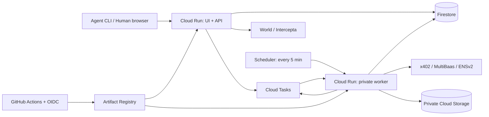

# GCPインフラ・Firestore・低コスト運用仕様

決定日: 2026-09-25。ユーザー指定によりCloud Run / Cloud Firestore / Cloud Storage / GitHub Actionsを採用する。これは実装仕様であり、リソース作成・課金確認・デプロイは未実施。

## 採用理由と配置

初期案のPostgreSQLは、予約・決済・承認の複数レコード更新と一意制約を表現しやすいため選んだ。今回はFirestoreの複数document transactionと決定的IDで同じ業務不変条件を実装する。Cloud SQLや常駐DBを必要としない。FirestoreにSQLの一意制約・外部キーがあると仮定しない。

| 用途 | 採用構成 | 初期設定・責任 |
| --- | --- | --- |
| UI + API | 公開Cloud Runサービス1個 | React/Viteの静的UIをFastifyから配信。同一HTTPS origin、SPAの/approve/{id}を維持 |
| 非同期処理 | 非公開Cloud Runサービス1個 | 同じimageのworker entrypoint。Cloud Tasks / Schedulerから認証付きHTTPで起動 |
| 業務データ | Firestore Native mode / Standard edition | event projectの(default) database。契約・決済・承認・暗号化宛先・outbox |
| ファイル | Cloud Storage Standard、private bucket | 匿名化したデモ証跡と、必要時の暗号化snapshot。public access prevention / uniform access |
| 遅延実行・再送 | Cloud Tasksのqueue1個 | IDだけをpayloadにする。決済照合・MultiBaas・ENSの小さな処理単位 |
| 取りこぼし回復 | Cloud Schedulerのjob1個 | 5分ごとにworkerのsweep endpointを呼ぶ。期限掃除・未配信outbox・照合待ちを小分けに検出 |
| CI/CD | GitHub Actions → Artifact Registry → Cloud Run | Linux標準runner、OIDC/Workload Identity Federation、image digest固定 |
| 秘密 | Secret Manager | provider credential、session/暗号化鍵、事業者testnet署名鍵を権限別に管理 |

初期regionはコスト優先のus-central1。Run、Firestore、Tasks、bucket、Artifact Registryを同regionにそろえる。これは日本国内保存要件がないハッカソン用の仮定。国内保存が必要ならDB作成前にasia-northeast1へ変更して再見積もりする。Firestoreのlocation変更を通常の設定変更として扱わない。GCSの無料storage対象regionに東京は含まれない。[GCP無料枠](https://docs.cloud.google.com/free/docs/free-cloud-features)

Next.jsの常駐SSRは不要なのでUIをReact/Viteへ変更する。UI assetはimageへ同梱し、GCSを別originの認証画面ホストにしない。初期公開URLはCloud RunのHTTPS URL。外部ロードバランサ、CDN、VPC connector、NAT、Redis、常時稼働VMは導入しない。

## Cloud Runの実行条件

- 2サービスともrequest-based billing、min instances=0。web: max instances=2 / concurrency=20、worker: max instances=1 / concurrency=1。各1 vCPU / 512 MiBを開始点とし、実測OOMがあればmemoryだけ見直す。
- HTTP timeout=60秒、処理内部の期限=40秒。chain finalityを待ち続けず、未確定を保存して次のtaskを予約する。リクエスト終了後のCPUやメモリ内timerに業務処理を依存させない。
- min=0はコールドスタートを許容する選択。read p95目標はwarmとcoldを分けて測り、無料運用と常時500ms応答を同時保証しない。
- health checkでDB全件走査・provider呼び出しをしない。keep-alive目的の定期アクセスは置かない。Schedulerの回復処理にも実行分の使用量は発生する。
- Cloud Tasksは初期max concurrent dispatches=1、max dispatches/sec=1、指数backoff、max attempts=10。業務outbox側も試行数・nextAttemptAt・上限到達後のmanual_reviewを保持し、sweepが無限に新taskを作らない。

[Cloud Run料金](https://cloud.google.com/run/pricing)、[Cloud Tasksによる非同期実行](https://docs.cloud.google.com/run/docs/triggering/using-tasks)に基づく設計。上記個数・秒数は本アプリ独自の初期値。

## Firestoreのデータ契約

[design.md](../.kiro/specs/realaddr/design.md)のcollection定義を使用する。documentにはschemaVersionを持たせる。時刻はFirestore Timestamp / APIではUTC ISO 8601。金額はcanonicalな10進整数文字列として保存し、演算・上限検証はbigintで行う。JS numberでtoken額を扱わない。slotは整数1..65535をrepositoryの書込境界でも検証する。

ブラウザ/AgentからのFirestore直接アクセスは全面拒否するrulesを配置する。APIとworkerは専用service accountのIAMでserver SDKを使用する。[server SDKはSecurity Rulesを迂回する](https://firebase.google.com/docs/firestore/security/rules-conditions)ため、Security Rulesによる保護を期待せず、すべての更新を認可付きrepository経由にする。管理スクリプトも同じvalidationを使う。

### 一意性・参照整合性

IDがそのまま一意性を表すものは同じdocumentに集約する。その他はuniques/{SHA256(JCS([kind,...canonicalTuple]))}を本体と同じtransactionでcreateする。guardには元tupleとresourceIdも保存し、不一致は409。check-then-writeの非transaction処理は禁止。

| 論理制約 | document / guard |
| --- | --- |
| wallet identity | uniques: chain + normalizedWallet → agentId |
| building + slot | slotsの決定的ID。発行済みleaseIdは削除・別leaseへ上書き不可 |
| orderのpayment | payments/{orderId} |
| 支払い認可の再利用 | uniques: network + asset + payer + authorizationNonce → orderId |
| 冪等キー | idempotency_keys/{hash(principal,method,path,key)}。bodyHashはフィールドで比較 |
| leaseの人間binding/profile/ENS binding | human_bindings/{leaseId}、mail_profiles/{leaseId}、ens_bindings/{leaseId} |
| 同時有効approval | approval_heads/{leaseId}で現在approvalIdを管理し作成/適用/取消をtransaction化 |
| OIDC state / refund / outbox | stateHash / paymentId / hash(aggregateId,version,eventType)を決定的IDにする |
| canonical ENS名 | uniques: normalizedName → leaseId。解約しても別leaseへ再利用しない |

参照先tenant/agent/leaseとversionの検査も同じtransactionで行う。外部キー相当の責任はrepositoryが負う。決済nonce、発行済みslot、名前、注文存続中の冪等キーを期限掃除で削除しない。

Firestore transactionは競合時にcallbackが再実行される。全readをwriteより前に行い、callbackにはDBの読み書きと純粋計算だけを入れる。**settle、署名、送金、ENS登録、Tasks enqueueをcallback内で実行しない。** ID/nonceもcallback外で生成して同じ操作のretryで固定する。[Firestore transactions](https://firebase.google.com/docs/firestore/manage-data/transactions)

### 65,535区画を安価に予約する

65,535 documentの事前seedはしない。buildingにcapacity=65535を持たせ、slot_shardsを64個だけ初期化する。shard 0..62は各1,024区画、63は1,023区画。slot番号=shard*1024+bitIndex+1。held/issuedの2bitmapとfreeCountを持つ。slot documentは初回hold時のみ作成する。

1. orderIdから候補shard順を決める。transactionで候補shard、冪等記録、wallet_hold_quotas、関連するslotを読み、空きbitを選ぶ。
2. 全read完了後にbit、freeCount、slot、order、冪等記録、wallet hold数を同時更新する。1walletの上限3を同じtransactionで保証する。
3. 競合はSDK retryと上限付き候補変更で回復する。競合だけでSOLD_OUTと断定しない。候補が尽きた場合は64shardの残数を確認し、空きありならretry可能なエラー、全0ならSOLD_OUTを返す。
4. 未決済が確定したhold解放はorder/payment状態を再検査し、bit・slot・quotaを同時更新する。settling/reconcilingは期限だけで解放しない。
5. 発行確定でheld bitをissued bitへ移し、lease/payment/mail/outboxとwallet quota解放を同時commitする。issued bitは解約後も保持する。renewは同じslot/leaseを更新する。

全capacityは論理区画数。全件list/readを避けるため、画面の空き数は64shardの集計を最大60秒cacheし参考値と表示する。予約可否・利用権認可にはcacheを使わない。

### Queryと料金を予測可能にする

paginationはcursor+limit（初期20、最大100）。lease一覧はagentId+updatedAt、処理待ちはstate+availableAt、hold掃除はstatus+expiresAt、監査はresourceId+occurredAtを主要queryとし、必要な複合indexをfirestore.indexes.jsonに管理する。大きいpayload、ciphertext、bitmap、responseSnapshotはindex対象外。配列へ監査履歴やjob全件を蓄積しない。

sweepは各query最大20件を処理し、残りはcursor付きtaskへ分割する。常時snapshot listener、collection全走査、offset paginationは禁止。UI/CLIはpending時だけ5秒→最大30秒のbackoffでpollし、完了・非表示時は停止。rate limitは共有Firestoreの時間bucketをtransaction更新する（IPは鍵付きhash）。メモリ制限は補助とし、複数instanceで回避できないことを検証する。

expiresAtは毎要求で検証する。無料枠に含まれないTTL deleteは初期構成では無効。短命session/challenge/rate bucketはSchedulerの期限queryで小分け削除し、削除操作数を予算に含める。個人情報・認証データ・送金payloadをindexやログへ複製しない。

## 決済・outbox・再起動

1. APIは署名payloadをverifyしてpayerをrisk判定し、transactionでprepared→settling、暗号化payload、slot固定、settlement outboxを保存する。判定の有効期限も保存する。
2. commit後にCloud Tasks enqueueをawaitして応答する。途中停止・enqueue失敗でもoutboxが残り、Schedulerが再配信する。enqueue不能なら202と再照合状態を返す。メモリ内で後処理を継続しない。
3. workerはoutboxのclaimOwner、claimUntil、claimGenerationをtransaction更新して処理権を取る。queue重複配信でも一度だけ状態適用する。max instances=1を排他制御の根拠にしない。
4. 未送信のsettle実行直前に期限/slot/payer/risk freshnessを再検査する。古いriskはlive再判定し、deny/holdなら送金しない。結果不明なら元認可とchainの照合へ進み、新nonceで課金しない。
5. 外部結果確定後、payment/lease/slot/mail/outboxをtransactionで更新。後続のMultiBaas→ENS作業を配信する。API executeの初回は202、完了後の同じexecuteは200。public schemaは変更せず、決済確定後の住所反映をchain名登録完了から分離する。

**処理claimの期限切れだけで外部送金をやり直さない。** 支払いは既存のfacilitator/chain照合規則に従う。自前chain送信はsigner+nonceの永続予約と同一raw transaction/hashの暗号化保存をbroadcast前に行い、未知状態は同じtxの照会/安全な再broadcastに限定する。MultiBaas管理署名では同等のrequest ID照合が実利用できることをT-00で確認し、できないwrite方式は採用しない（自前送信+MultiBaas read/eventへ切替可）。

Cloud Tasksは配信をexactly-onceにしない。task IDの短期重複排除だけに頼らず、outbox/versionと外部照合が業務の冪等性を保証する。Schedulerにも同じsweep claimを設ける。reorgや古いversionのtaskは現在の確定状態と照合する。worker応答喪失後でも同じENS名・同じ契約へ収束させる。

## IAM・CI/CD・復旧

- web用、worker用、task invoke用、scheduler invoke用、deploy用service accountを分ける。workerにallUsers invokerを付与しない。呼出元OIDCのaudienceをworker URLに固定し、task/sweep endpointで期待する主体も検査する。
- webはFirestore・Tasks enqueue・必要secret読取、workerはFirestore・必要secret・bucket限定操作・再enqueueだけを付与。invoker用主体はDB/秘密にアクセス不可。enqueueする主体のserviceAccountUserは対象invoke accountだけに限定する。
- PRはlint/typecheck/unit/Firestore Emulator/Foundry/buildを実施する。live秘密をfork PRへ渡さない。mainの検証済みcommitをGitHub Environment eventへdeployする。actionsはSHA pin、workflow権限は最小限とする。
- GitHub OIDCからWorkload Identity Federationで短期credentialを得る。trust条件をrepository ID・owner ID・許可ref/environmentへ絞る。サービスアカウントJSON鍵をGitHub Secretsへ保存しない。[WIF公式手順](https://cloud.google.com/iam/docs/workload-identity-federation-with-deployment-pipelines)
- DockerをActionsでbuildしArtifact Registryへpush、同じdigestを2サービスへdeployする。Cloud Buildを別途起動しない。bootstrap IAM/DB作成と通常deploy権限を分離する。schemaは後方互換追加を優先し、index readyを確認後に新queryへ切替える。
- infra/に再実行可能な設定とbootstrap/deploy script、Firestore rules/indexes、queue retry、Scheduler、bucket lifecycle、image cleanupを保存する。既存DBを自動初期化しない。rollbackは旧image digestへのtraffic復帰とする。
- snapshotはハッカソン前の手動手順: 新規書込停止→queue pause→実行中処理の収束/不明記録保存→全DB writer停止→小規模DBをページ取得して暗号化snapshotをprivate GCSへ保存→manifest/hash検証→再開。通常宛先を平文ファイルに出さない。restoreはEmulatorへ行い、uniques/shard/冪等記録を照合する。snapshot中もchainは進むため、復元後は新規settle前にchain照合が必須。無停止・時点復旧は保証しない。
- 初期構成では有料のmanaged backup/PITRは有効化しない。snapshot以降のデータ損失リスクを運用記録に残す。商用移行時は予算を付けて別途復旧要件を決める。event snapshot保持7日、宛先はイベント後30日で削除し、snapshot内も期間内に消えることを確認する。

## 無料枠とコスト方針

2026-09-25時点。無料トライアルの一時creditに依存せず、小規模event利用で無料枠中心の運用を狙う。billing accountは必要。無料枠の既存消費、region、通信先、provider料金により請求が変わるため「必ず0円」とはしない。

| サービス | 主な無料枠・費用条件 | 本構成の管理方法 |
| --- | --- | --- |
| Cloud Run request-based | 月200万request、18万vCPU秒、36万GiB秒（Tier 1相当の無料枠） | min=0。web/worker/定期処理の合計で測定 |
| Firestore | 1GiB、日5万read/2万write/2万delete、月10GiB outbound。無料quota対象DBはproject内1個 | 小分けquery、index削減、全区画seed禁止 |
| Cloud Storage | 指定US regionのStandard 5GB-month、月5,000 Class A / 50,000 Class B | private、小容量、期限削除。転送先/operation条件も確認 |
| Cloud Tasks | 月100万billable operations | create/delivery/retryを含む。32KBごとに計上。小payload |
| Cloud Scheduler | billing accountあたり月3job | 1jobへまとめる。呼出先実行費用は別 |
| Artifact Registry | accountあたり0.5GiB-month | 稼働/rollback digestを保持し不要imageをcleanup。超過分課金 |
| Secret Manager | 月6 active versions、10,000 access | 権限分離を優先し超過分は少額予算。disabled版もactive計上 |
| GitHub Actions | 公開repoの標準runnerは無料。privateはplan枠 | Linux標準runner、artifact保持7日、不要build抑制 |

根拠: [Run](https://cloud.google.com/run/pricing)、[Firestore](https://firebase.google.com/docs/firestore/pricing)、[Storage無料枠](https://docs.cloud.google.com/free/docs/free-cloud-features)、[Tasks](https://cloud.google.com/tasks/pricing)、[Scheduler](https://cloud.google.com/scheduler/pricing)、[Artifact Registry](https://cloud.google.com/artifact-registry/pricing)、[Secret Manager](https://cloud.google.com/secret-manager/pricing)、[Actions](https://docs.github.com/en/billing/concepts/product-billing/github-actions)。FirestoreのTTL/PITR/backup/restoreは無料枠に含まれない。read料金には条件によりindex entry readも入る。日次quotaは太平洋時間基準。Run等のaccount単位無料枠は他projectと共有する。

検証用の使用量目標: 月20,000 public request・100契約・chain操作数百件、Run合計50,000 vCPU秒/25,000 GiB秒以下、Firestore日10,000 read/2,000 write/1,000 delete以下・保存0.2GiB、Tasks月30,000 operations以下、GCS保存0.1GB。Schedulerは5分ごとで月約8,640回（30日）になり、この処理も上記へ含める。これらは性能試験の結果ではなく予算上の上限目標。実測で超える場合は原因と見積もりを記録する。

主要サービスはこの規模なら無料枠に収まる可能性が高い。例としてSecret Managerのsingle-location相当active版が10個なら超過4個で約$0.24/月、Artifact Registryが1GiBなら超過0.5GiBで約$0.05/月がstorageだけの概算。少額の通信料等を含む余裕としてeventのGCP予算を月$5に設定する（料金保証ではない）。Gas・ENS名・RPC・スポンサーAPI・ドメイン・開発AI利用料は別管理で、無料提供/テストネットだから永続無料とはしない。

通常のalerts-only予算は利用停止の上限ではない。[Cloud Billing budgets](https://docs.cloud.google.com/billing/docs/how-to/budgets)。50/90/100%通知、Run instance数、queue速度/試行数、API quota、日次新規契約件数を併用する。instance上限だけで請求総額を固定できない。初期日次新規契約上限は100件としFirestoreのUTC日付budget documentで原子的に予約、確定消費を記録する。orderへ予約時のUTC日付を保存し、未払い確定の取消/期限切れは元の日付bucketの予約だけ解放、支払確定は元bucketの消費へ移す。renewは新規件数に含めない。未知決済の予約は解放しない。上限到達時は新規購入を止め、既存契約閲覧と決済照合を継続する。

[GCS soft delete](https://docs.cloud.google.com/storage/docs/soft-delete)/旧世代保持、image増殖、verbose log、日本などへの外向き通信にも費用が発生しうる。bucketはハッカソン用でversioning/soft deleteを無効とする選択を明記し、snapshot自体の7日保持で誤削除リスクを管理する。Secret版の破棄は復号/rollbackへの不要確認後のみ。無料枠を守るために鍵を公開したり、決済記録を省略したりしない。
