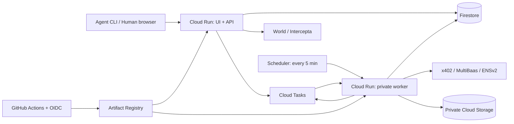

# GCPインフラ・Firestore・低コスト運用仕様

決定日: 2026-09-25。ユーザー指定によりCloud Run / Cloud Firestore / Cloud Storage / GitHub Actionsを採用する。これは実装仕様であり、リソース作成・課金確認・デプロイは未実施。

## 採用理由と配置

初期案のPostgreSQLは、予約・決済・承認の複数レコード更新と一意制約を表現しやすいため選んだ。今回はFirestoreの複数document transactionと決定的IDで同じ業務不変条件を実装する。Cloud SQLや常駐DBを必要としない。FirestoreにSQLの一意制約・外部キーがあると仮定しない。

| 用途 | 採用構成 | 初期設定・責任 |
| --- | --- | --- |
| UI + API | 公開Cloud Runサービス1個 | React/Viteと公開用prerender HTMLをFastifyから配信。同一HTTPS origin、app/admin/approvalの既知routeを配信 |
| 非同期処理 | 非公開Cloud Runサービス1個 | 同じimageのworker entrypoint。Cloud Tasks / Schedulerから認証付きHTTPで起動 |
| 業務データ | 既存projectのFirestore Native mode / Standard edition | 共有の`(default)` databaseを参照。全論理collectionに`realaddr_event_`を付け、DB本体とrulesは既存の管理主体が所有 |
| ファイル | Cloud Storage Standard、private bucket | 匿名化したデモ証跡と、必要時の暗号化snapshot。public access prevention / uniform access |
| 遅延実行・再送 | Cloud Tasksのqueue1個 | IDだけをpayloadにする。決済照合・MultiBaas・ENSの小さな処理単位 |
| 取りこぼし回復 | Cloud Schedulerのjob1個 | 5分ごとにworkerのsweep endpointを呼ぶ。期限掃除・未配信outbox・照合待ちをcursor付きのbounded pageで検出 |
| CI/CD | GitHub Actions → Artifact Registry → Cloud Run | Linux標準runner、OIDC/Workload Identity Federation、image digest固定 |
| 秘密 | Secret Manager | provider credential、session/暗号化鍵、事業者testnet署名鍵を権限別に管理 |

### Terraformとデプロイの責任境界（T-16の実装契約）

`infra/bootstrap`と`infra/app`の2 rootを作る。利用するGCP project IDを参照し、project・billing・GitHub repository・DNS zone/record・`(default)` Firestore DB・project予算は作成、import、管理しない。bootstrapは本アプリ専用のTerraform state用private GCS bucket、Artifact Registry repository、GitHub OIDC/WIF pool・providerを管理する。デプロイ用service accountは保護された`DEPLOY_SERVICE_ACCOUNT`設定で明示参照し、本アプリのstateへimport・作成・削除しない。必要なproject APIの有効化は管理主体と調整した運用手順で行い、本アプリのstateには含めない。初回bootstrapは管理者がローカルstateで実行し、state bucket作成後のbootstrap state移行はバックアップ・移行先確認を伴う別の手動手順として記録する。現時点ではstate作成も移行も未実施。app rootは専用state bucketをGCS backendとして使い、本アプリ専用のCloud Run 2サービス、web/worker/tasks/schedの4 service account、業務用private bucket、Tasks/Scheduler、Secret Managerのsecret metadata、限定したIAM、`realaddr_event_` collection groupだけの複合indexとfield exemptionを管理する。backend bucketは先に存在する必要があり、GCS backendはstate lockingに対応する。[Terraform GCS backend](https://developer.hashicorp.com/terraform/language/backend/gcs)

state bucketと業務用bucketは分離し、他サービスのstate bucket/prefixも共有しない。state prefixはbootstrapが`realaddr/event/bootstrap`、appが`realaddr/event/app`。state bucketはuniform bucket-level access、public access prevention、versioning、削除防止を設定し、読書き権限を本アプリのinfra管理主体だけへ絞る。versioningの保持量・費用を監視する。業務用bucketには後述の短期保持とsoft delete無効の方針を適用し、Terraform stateを置かない。Terraform変数・state・planにprovider秘密、署名鍵、World情報、宛先、支払いpayloadを入れない。secret名とIAMだけをTerraformで管理し、値は権限を持つ運用者がSecret Managerへ別途登録する。未設定のsecretを成功用の仮値で埋めない。

Terraform/providerの動作確認済みversionと各rootの`.terraform.lock.hcl`を管理する。`.terraform/`、local state/backup、plan、実値を含むtfvars、認証ファイルはGit対象外にし、公開用exampleにはplaceholderだけを置く。bootstrapの初回image指定とstate移行を含むコマンドは実装時に記載し、現時点で実行可能と主張しない。

T-16の必須共存ゲートでproject内の既存Cloud Run、Firestore DB/rules/index、API、IAM、予算、bucket、Artifact Registry、Tasks、Scheduler、Secret Manager、WIF、service accountと各resourceの所有者を読み取り確認する。現時点ではlive inventoryを実施していない。共有resourceを本アプリのstateへimportしない。同名の既存resourceが本アプリ所有と確認できなければ上書き・importを止め、明示的に設定したsuffixで衝突を解消する。毎回ランダム名を生成しない。apply前のplanは本アプリ専用resourceと許可されたprefix collection indexだけに限定し、他サービスへの変更があれば停止する。

基本の`RESOURCE_PREFIX=realaddr-event`と名前は次の通り。実project ID、認証主体、bucketの実値や衝突回避suffixは保護された設定manifestに置き、リポジトリへ展開しない。同名衝突でsuffixを選ぶ場合はresource名と`FIRESTORE_COLLECTION_PREFIX`の物理mapperを同じmanifestで確定し、コード・Terraform・運用手順で一致を検査する。運用開始後のprefix変更は既存documentの移行を伴うため、単純な設定変更として扱わない。

| Resource | 基本名・範囲 |
| --- | --- |
| Cloud Run | `realaddr-event-web`、`realaddr-event-worker` |
| Artifact Registry | `realaddr-event-images` |
| Cloud Tasks / Scheduler | `realaddr-event-jobs` / `realaddr-event-sweep` |
| 新規service account | `realaddr-event-web`、`realaddr-event-worker`、`realaddr-event-tasks`、`realaddr-event-sched` |
| deploy service account | `DEPLOY_SERVICE_ACCOUNT`で保護された設定manifestから明示指定。本アプリのstateで作成・import・削除しない |
| WIF | pool `realaddr-event-gh`、pool内provider `github` |
| Secret Manager | `realaddr-event-<purpose>` |
| GCS | `${GCP_PROJECT_ID}-realaddr-event-data`、`${GCP_PROJECT_ID}-realaddr-event-tfstate` |

web/worker/tasks/schedは本アプリ専用の別々のservice accountを新規作成する。default runtime/invoker accountやservice account鍵をfallbackとして使わない。デプロイ用service accountは`DEPLOY_SERVICE_ACCOUNT`として保護された設定manifestで明示指定し、本アプリのstateへimport・作成・削除しない。所有者・現在のgrant・実効権限をinventoryし、この主体自体が最小権限だと主張しない。本アプリで追加するgrantは対象の専用resourceへ限定し、他のgrantを変更しない。本アプリ専用WIF pool/providerの信頼条件から指定したデプロイ用service accountへのimpersonationを設定する場合、service account IAM policy管理主体と競合しないadditive memberだけを追加し、現在のWIF bindingやproviderを置換しない。Google管理のservice agentはproject単位のGoogle identityであり、アプリごとに再作成したり完全分離を約束したりしない。共有`(default)` DBを使用するため、専用runtime service accountやcollection prefixだけで他collectionへのIAM隔離が成立するとは扱わない。

共有projectのIAM全体を上書きする`google_project_iam_policy`と、role単位で既存memberを置換する`google_project_iam_binding`を使わない。本アプリの追加grantは`google_project_iam_member`を必要最小限で使い、可能なものは本アプリresourceに限定する。共存ゲートで既存IAMの管理方法を確認し、別stateが同じroleのauthoritative bindingを管理する場合はmemberとの競合を避ける。既存の広いIAM grantも共存ゲートで確認する。共有Firestoreのserver IAMはcollection単位で隔離できると仮定せず、collection prefixにデータアクセスのIAM隔離効果があるとは扱わない。[Terraform Google project IAM](https://registry.terraform.io/providers/hashicorp/google/latest/docs/resources/google_project_iam)はpolicyをproject全体、bindingをrole単位のauthoritative変更と定義する。共有APIを無効化しない。将来`google_project_service`を採用する場合も`disable_on_destroy=false`を指定し、他サービスの稼働に影響するAPI disableを禁止する。[Service Usage](https://docs.cloud.google.com/service-usage/docs/enable-disable)、[Terraform project service](https://registry.terraform.io/providers/hashicorp/google/latest/docs/resources/project_service.html)。環境別のstate prefixとGitHub Environmentを分け、event用のservice accountに付けるstate/secret/image権限は本アプリ専用resourceへ限定する。専用の常駐サービスや固定費のedge/networkは初期構成に追加しない。

Cloud Runのサービス設定とIAMはTerraformが所有し、通常のGitHub Actionsデプロイは検証済みimage digestだけを更新する。実装時にGoogle providerの対象schemaでimage属性だけの`ignore_changes`を確認・限定し、その他の設定差分はTerraform planで検出する。[Terraform lifecycle](https://developer.hashicorp.com/terraform/language/meta-arguments/lifecycle)に従い、属性全体を無視しない。webとworkerへ同じdigestを順に反映し、両revisionのdigest・min=0・invoker IAMを再読込して検証する。Cloud Run 2サービスの更新は原子的ではないため、片方だけ更新された場合は旧digestへ戻すか残りを安全に再実行し、状態を失敗として記録する。rollbackは確認済み旧digestを2サービスへ戻して再検証する。

既存`(default)` Firestoreの実locationをT-16で確認し、本アプリから移動・再作成しない。新規Cloud Run/Tasks等のregionはDBの実配置を優先して選ぶ。DBがregionalなら原則同region、multi-regionなら公式の配置・通信条件を確認し、保存要件・遅延・通信費を見積もってから固定する。`us-central1`は未確認時の仮置き値であり適用値ではない。GCSの無料storage対象regionに東京は含まれない。[GCP無料枠](https://docs.cloud.google.com/free/docs/free-cloud-features)

公開/・/developers・/faqはbuild時生成HTMLとして本文とリンクを初回応答へ含める。React/Viteの認証画面と共通部品を使い、常駐SSRは追加しない。UI assetはimageへ同梱し、GCSを別originの認証画面ホストにしない。公開originはhttps://address.chain.tokyo。eventの初期接続方式はCloud Run direct domain mappingとする。T-16で実regionの対応、ドメイン所有確認、mapping対象serviceと既存mappingとの衝突を確認し、満たせなければ公開を停止して別方式を明示決定する。mapping作成後にGoogleが返したDNS recordとmanaged certificateの状態をユーザーへ提示し、ユーザーがDNSを設定する。別サービスのmapping/recordを上書き・共有しない。このmappingは公式資料でpreview扱いでありproductionには推奨されないため、将来の商用公開では接続方式を再検討する。[Cloud Run custom domain mapping](https://docs.cloud.google.com/run/docs/mapping-custom-domains)。実mapping・DNS/TLSは未作成・未検証で、完了までは公開稼働済みとしない。管理画面も同じwebサービスの/adminで配信し、Google OIDCと独立した管理sessionで保護する。追加の管理用Cloud Runや認証用ロードバランサは初期構成に設けない。外部ロードバランサ、CDN、VPC connector、NAT、Redis、常時稼働VMは導入しない。

## Cloud Runの実行条件

- 2サービスともrequest-based billing、min instances=0。web: max instances=2 / concurrency=20、worker: max instances=1 / concurrency=1。各1 vCPU / 512 MiBを開始点とし、実測OOMがあればmemoryだけ見直す。
- HTTP timeoutの初期目標=60秒。workerは25秒のbounded sweep予算など処理ごとの期限を実装で明示し、chain finalityを待ち続けず未確定を保存して次のtaskを予約する。Firestore deadline等を含む実行上限が未実装の間、40秒の処理期限を保証済みとして扱わない。リクエスト終了後のCPUやメモリ内timerに業務処理を依存させない。
- min=0はコールドスタートを許容する選択。read p95目標はwarmとcoldを分けて測り、無料運用と常時500ms応答を同時保証しない。
- health checkでDB全件走査・provider呼び出しをしない。keep-alive目的の定期アクセスは置かない。Schedulerの回復処理にも実行分の使用量は発生する。
- Cloud Tasksは初期max concurrent dispatches=1、max dispatches/sec=1、指数backoff、max attempts=10。業務outbox側も試行数・nextAttemptAt・上限到達後のmanual_reviewを保持し、sweepが無限に新taskを作らない。

[Cloud Run料金](https://cloud.google.com/run/pricing)、[Cloud Tasksによる非同期実行](https://docs.cloud.google.com/run/docs/triggering/using-tasks)に基づく設計。上記個数・秒数は本アプリ独自の初期値。

## Firestoreのデータ契約

[design.md](../.kiro/specs/realaddr/design.md)の論理collection定義を使用する。`FIRESTORE_DATABASE_ID=(default)`、基本の`FIRESTORE_COLLECTION_PREFIX=realaddr_event_`とし、repositoryの単一mapperだけが論理名を物理collection ID `realaddr_event_<logical>`へ変換する。admin、guard、outbox、session、rate limitなど例外を作らず、本アプリの全root collectionに適用する。衝突時に明示suffixを採用した場合も、そのmanifestのprefixを単一mapper・index設定・cleanupで共用する。直接のcollection名指定を他の実装箇所に散らさない。prefixは同一DB内の名前衝突を防ぐもので、IAMまたはSecurity Rulesによる隔離を保証しない。documentにはschemaVersionを持たせる。時刻はFirestore Timestamp / APIではUTC ISO 8601。金額はcanonicalな10進整数文字列として保存し、演算・上限検証はbigintで行う。JS numberでtoken額を扱わない。slotはrepositoryの書込境界でも整数1..65535を検証する。[Firestore複数DB管理](https://firebase.google.com/docs/firestore/manage-databases)によるとclient libraryは通常`(default)`へ接続するため、実行時のdatabase IDも明示的に検査する。

owner向けorder/lease一覧readの複合index契約は、物理collection group `realaddr_event_orders`で`tenantId ASC, agentId ASC, createdAt DESC, __name__ DESC`、`realaddr_event_leases`で`tenantId ASC, agentId ASC, updatedAt DESC, __name__ DESC`とする。cursor pagingはこの順序とlimitに固定し、署名cursorをowner/endpoint/sort/limitへ束縛する。これはアプリ側のindex定義契約であり、GCP上へのindex作成・適用は未実施。index変更は本アプリprefix付きcollection groupだけを対象とする。

本アプリはブラウザ/AgentからFirestoreへ直接アクセスしない。既存`(default)` DB全体のSecurity Rulesは共有の管理主体が所有し、本アプリから配信・全面置換しない。T-16ではlive rulesを読み取り、Firebase clientなどRulesが適用される経路で本アプリprefixの代表パスに対する未認証・他利用者のread/write拒否を少数確認する。rulesの読取・評価ができなければ共存ゲートを通さない。server SDKやIAM認証RESTによる試行はRulesを迂回するため、この確認の代わりにならない。本アプリのprefix下が既存rulesの広い`allow`でclientからアクセス可能なら共存ゲートを失敗とし、共有管理主体が既存サービスを壊さない形で修正してから進める。重複する`allow`はORで評価され、追加の`deny`で広い許可を取り消せない。[Rules評価](https://firebase.google.com/docs/rules/rules-behavior)、[Rulesの配信](https://firebase.google.com/docs/firestore/security/get-started)。APIとworkerは専用service accountのIAMでserver SDKを使用する。[server SDKはSecurity Rulesを迂回する](https://firebase.google.com/docs/firestore/security/rules-conditions)ため、すべての更新を認可付きrepository経由にする。管理スクリプトも同じvalidationを使う。既存の広いproject IAMがあればprefix外へのserver accessも可能なので、権限の実態をT-16で確認する。apply前は既存resourceのread-only inventory、IAM管理方法とplan、Rules適用clientの拒否を確認する。新規web/worker runtime service accountは専用resourceの作成後、顧客データ投入・公開業務routeの有効化前に実identityで共有DBへの必要操作と対象外DBへの拒否を確認する。運用者credentialでの成功はruntime主体の権限証拠にならず、documentのNOT_FOUNDはIAM拒否の証拠にならない。

### 一意性・参照整合性

IDがそのまま一意性を表すものは同じdocumentに集約する。その他はuniques/{SHA256(JCS([kind,...canonicalTuple]))}を本体と同じtransactionでcreateする。guardには元tupleとresourceIdも保存し、不一致は409。check-then-writeの非transaction処理は禁止。

| 論理制約 | document / guard |
| --- | --- |
| wallet identity | uniques: chain + normalizedWallet → agentId |
| building + slot | slotsの決定的ID。発行済みleaseIdは削除・別leaseへ上書き不可 |
| orderのpayment | payments/{orderId} |
| 支払い認可の再利用 | uniques: network + asset + payer + authorizationNonce → orderId |
| 冪等キー | idempotency_keys/{hash(principal,method,path,key)}。bodyHashはフィールドで比較 |
| leaseの人間binding/profile/ENS binding | human_bindings/{leaseId}、mail_profiles/{leaseId}、ens_bindings/{leaseId} |
| ENS初回購入の排他・購入権 | ens_entitlements/{leaseId}。pending_paymentのintentIdとpaid/refund_pending/refundedを永続化し、送金不明では解放しない |
| 同時有効approval | approval_heads/{leaseId}で現在approvalIdを管理し作成/適用/取消をtransaction化 |
| OIDC state / refund / outbox | stateHash / paymentId / hash(aggregateId,version,eventType)を決定的IDにする。refundは発行失敗が確定した元paymentごとに一件、署名済みtxとnonceを送信前に保持 |
| canonical ENS名 | uniques: ENSIP-15正規化完全名 → leaseId/intentId/state。追加見積と同時予約し、未払い確定した未発行予約だけ解放する。paid以降は解約・返金後も別leaseへ再利用しない |
| 拠点ENS namespace | ens_namespaces/{buildingId}。上位registry→拠点label→拠点専用registryの接続を保持し、他拠点へ流用しない |

参照先tenant/agent/leaseとversionの検査も同じtransactionで行う。外部キー相当の責任はrepositoryが負う。決済nonce、発行済みslot、名前、注文存続中の冪等キーを期限掃除で削除しない。

Firestore transactionは競合時にcallbackが再実行される。全readをwriteより前に行い、callbackにはDBの読み書きと純粋計算だけを入れる。**settle、署名、送金、ENS登録、Tasks enqueueをcallback内で実行しない。** ID/nonceもcallback外で生成して同じ操作のretryで固定する。[Firestore transactions](https://firebase.google.com/docs/firestore/manage-data/transactions)

### 65,535区画を安価に予約する

65,535 documentの事前seedはしない。buildingにcapacity=65535を持たせ、slot_shardsを64個だけ初期化する。shard 0..62は各1,024区画、63は1,023区画。slot番号=shard*1024+bitIndex+1。held/issuedの2bitmapとfreeCountを持つ。slot documentは初回hold時のみ作成する。

1. 公開APIのfloorに希望する区画番号があればそのshard/bitを検証し、なければorderIdから候補shard順を決める。transactionで対象shard、冪等記録、wallet_hold_quotas、関連するslotを読み、空きbitを選ぶ。希望区画が使用中なら同じtransactionの判定で`slot_unavailable`を返し、別の区画へ自動変更しない。
2. 全read完了後にbit、freeCount、slot、order、冪等記録、wallet hold数を同時更新する。1walletの上限3を同じtransactionで保証する。
3. 競合はSDK retryと上限付き候補変更で回復する。競合だけでsold_outと断定しない。候補が尽きた場合は64shardの残数を確認し、空きありならretry可能なエラー、全0ならsold_outを返す。
4. 未決済が確定したhold解放はorder/payment状態を再検査し、bit・slot・quotaを同時更新する。settling/reconcilingは期限だけで解放しない。
5. 発行確定でheld bitをissued bitへ移し、lease/payment/mail/outboxとwallet quota解放を同時commitする。issued bitは解約後も保持する。renewは同じslot/leaseを更新する。

全capacityは論理区画数。全件list/readを避けるため、画面の空き数は64shardの集計を最大60秒cacheし参考値と表示する。予約可否・利用権認可にはcacheを使わない。

### Queryと料金を予測可能にする

paginationはcursor+limit（初期20、最大100）。lease一覧はagentId+updatedAt、intent一覧はagentId+createdAt（同時刻はdocument IDで安定順序）、処理待ちはstate+availableAt、hold掃除はstatus+expiresAt、監査はresourceId+occurredAtを主要queryとする。管理一覧は拠点status、決済/契約status・locationId（内部buildingId）、処理projection kind/status、監査targetType+targetIdの実際に使う完全一致filterと時刻降順+document ID降順だけに必要な複合indexを用意する。ID一件照会はdocument直接読取とし、処理projectionもprefix mapperを通す。必要な複合indexとfield exemptionは`realaddr_event_`で始まる本アプリ専用collection groupのものだけをTerraformのapp stateで管理できる。他サービスのindex削除・変更、全DB index定義の包括的なFirebase deployは禁止する。大きいpayload、ciphertext、bitmap、responseSnapshotは本アプリcollectionでindex対象外。配列へ監査履歴やjob全件を蓄積しない。

sweepは5分ごとのScheduler tickあたり一つのbounded pageだけを処理する。各cycle開始時のcutoff `through`を固定し、処理待ちは`state in [pending, processing]`、`availableAt <= through`、`availableAt ASC, document ID ASC`の順で最大20件を取得する。`ops_metrics`のprefix付きdocumentにsweep claim（60秒）、固定cutoff、永続cursorを保存し、重複Scheduler要求をfenceする。pageを使い切った後にcursorを保存し、次のtickで同じcutoffの続きから読む。query末尾に達したらcursorをwrapして先頭へ戻し、新cycleのcutoffを取り直す。これにより新規jobの流入で一つの巡回が延び続けることを防ぎ、前のpageで保留したjobも次の巡回で再訪する。workerはdispatch reconciliation operationsを最大5並列で起動し、25秒の処理予算後は新規jobを開始しない。開始済み呼出しとDB更新をawaitし、未処理entryをcursorの次周回で再訪する。skip/failureもcursorを進め、次の周回で再訪する。未処理分のcontinuation taskは作らない。この決定は以前の「残りをcursor付きtaskへ分割する」記述を置き換える。常時snapshot listener、collection全走査、offset paginationは禁止。UI/CLIはpending時だけ5秒→最大30秒のbackoffでpollし、完了・非表示時は停止。rate limitは共有Firestoreの時間bucketをtransaction更新する（IPは鍵付きhash）。メモリ制限は補助とし、複数instanceで回避できないことを検証する。

expiresAtは毎要求で検証する。無料枠に含まれないTTL deleteは初期構成では無効。短命session/challenge/rate bucketはSchedulerの期限queryで小分け削除し、削除操作数を予算に含める。個人情報・認証データ・送金payloadをindexやログへ複製しない。

## 決済・outbox・再起動

1. APIは署名payloadをverifyしてpayerをrisk判定し、transactionでprepared→settling、暗号化payload、slot固定、settlement outboxを保存する。判定の有効期限も保存する。
2. APIはcommit後にenqueueをawaitして応答する設計だが、このAPI経路へのTasks adapter接続は未実装である。worker専用dispatcherでのCloud Tasks enqueueは`CLOUD_TASKS_DISPATCH_ENABLED=true`の場合だけ許可する。この設定は`APP_ENV=event`でのみ許可し、`GCP_REGION`、`TASKS_QUEUE=realaddr-event-jobs`、専用worker runtime、HTTPS `WORKER_URL` origin、専用`TASK_INVOKER_SA`が揃い一致するときに限る。local/defaultはfalse。worker dispatcherはCloud Run metadata serverから得たruntime identity emailを検証し、key fileやADC fallbackを使わない。dispatchを無効化またはenqueue結果不明でもoutboxは残り、dispatch有効時にSchedulerが再照合する。API接続後はenqueue不能なら202と再照合状態を返す設計とする。メモリ内で後処理を継続しない。
3. Cloud Tasks task IDはoutbox IDと永続`taskGeneration`から作るstable hashとする。CreateTask結果が不明なら同じtask IDで再試行する。409は即成功扱いせずGETし、taskが存在すればqueue presenceを確認済みとする。409後または以前のconfirmed後にGETが404ならtaskを再作成せずgenerationを回転し、次のsweepで新IDを作る。確認済みqueue presenceは業務履行を意味しない。dispatch claim（60秒、owner+generation）とworker execution claim（owner/until/generation）は別々に永続化する。per-job dispatch backoffは`dispatchAvailableAt`へ保存し、5秒から倍増して最大300秒とする。dispatch claimはexecutionの`availableAt`を変更しない。
4. workerはoutboxのexecution claimをtransaction更新して処理権を取る。queue重複配信でも一度だけ状態適用する。max instances=1を排他制御の根拠にしない。
5. 未送信のsettle実行直前に期限/slot/payer/risk freshnessを再検査する。古いriskはlive再判定し、deny/holdなら送金しない。結果不明なら元認可とchainの照合へ進み、新nonceで課金しない。
6. 外部結果確定後、order kindごとにtransactionで確定する。住所購入・更新はpayment/lease/slot/mail/outboxとMultiBaas同期を更新し、ENS購入済みの場合だけENSの期限同期を配信する。ens_addonはpayment/ens_entitlements/outboxを確定し、区画の再割当や住所期限延長をしない。公開pay endpointの初回は202、完了後の同じpay要求は200。決済確定とENS名登録完了は別状態とする。

**処理claimの期限切れだけで外部送金をやり直さない。** 支払いは既存のfacilitator/chain照合規則に従う。自前chain送信はsigner+nonceの永続予約と同一raw transaction/hashの暗号化保存をbroadcast前に行い、未知状態は同じtxの照会/安全な再broadcastに限定する。MultiBaas管理署名では同等のrequest ID照合が実利用できることをT-00で確認し、できないwrite方式は採用しない（自前送信+MultiBaas read/eventへ切替可）。

内部outbox execution retryは最大5回、dispatch reconciliation claimはoutbox累積最大10回とする。内部再試行間隔は5秒から倍増し最大300秒、dispatch用`dispatchAvailableAt`も5秒から倍増して最大300秒とする。上限に達したjobは`manual_review`とadmin projectionへ永続化する。dispatch reconciliationの上限到達も同様にmanual reviewへ送る。いずれもpayment success、refund、hold/slot releaseを意味しない。claimごとにgenerationを増やし、完了・再試行・業務適用は同じtransaction内でowner/generation/期限と対象versionを照合する。dispatch claimとexecution claimは独立し、両方とも60秒、owner+generationを保存する。期限切れの`processing`を取得した場合は`reconciliationOnly=true`を永続化し、後の再試行でも消さない。この状態を新規送金の許可として使わない。workerへ渡すHTTP bodyは`outboxId`だけとし、receiptや検証済みフラグは受け取らない。

処理中は`availableAt=claimUntil`とし、due照会は`state in [pending, processing]`、`availableAt <= now`、`availableAt ASC, document ID ASC`で最大20件に限定する。cursorとScheduler sweep claimは`ops_metrics`のprefix付きcollectionへ保存する。必要な複合indexは`realaddr_event_outbox`の`state ASC, availableAt ASC`だけを対象とする。Emulatorでの照会成功は実環境のindex配備証拠ではない。実indexの作成はT-16の所有権確認とapp側Terraformの実装・適用後に行い、共有DB全体のindex定義を置換しない。

Cloud Tasksは配信をexactly-onceにしない。task IDの短期重複排除だけに頼らず、outbox/versionと外部照合が業務の冪等性を保証する。Scheduler sweep claimは`ops_metrics`に別途設ける。terminalの`completed`、`superseded`、`manual_review`、またはoutbox欠落task deliveryには200 ACKを返す。`manual_review`へのACKは履行を表さない。busyまたはnot-dueのdeliveryは503として再配信を促す。handler利用不可の場合も業務outbox実行上限5回の後にmanual reviewへ送る（Cloud Tasks queueのmax attempts=10とは別の上限）。reorgや古いversionのtaskは現在の確定状態と照合する。worker応答喪失後でも同じENS名・同じ契約へ収束させる。[Cloud Tasks CreateTask](https://docs.cloud.google.com/tasks/docs/reference/rest/v2/projects.locations.queues.tasks/create)の409/存在確認を使って不明結果を回復し、[Cloud Run metadata server](https://docs.cloud.google.com/run/docs/container-contract#metadata-server)から実行主体emailを検証する。Cloud Tasks/Scheduler/GCP resourceの作成・実配信・IAM/Rules gateは未実施・未検証であり、この記述は運用仕様である。

## IAM・CI/CD・復旧

- web用、worker用、task invoke用、scheduler invoke用の4つの専用service accountを新規作成し、デプロイ用service accountは保護された`DEPLOY_SERVICE_ACCOUNT`設定で指定する。workerにallUsers invokerを付与しない。呼出元OIDCのaudienceをworker URLに固定し、task/sweep endpointで期待する主体も検査する。
- webはFirestore・Tasks enqueue・必要secret読取、workerはFirestore・必要secret・bucket限定操作・再enqueueだけを付与。invoker用主体はDB/秘密にアクセス不可。enqueueする主体のserviceAccountUserは対象invoke accountだけに限定する。
- コード変更のCIはbuild/typecheckと変更に関係する最小チェックだけを実施する。Firestore Emulator/Foundryは決済・区画・権限など該当する重要箇所の変更時に限定し、文書だけの変更では文字コードと差分確認でよい。全suiteやlive接続を毎PRで実行しない。live秘密をfork PRへ渡さない。mainの検証済みcommitをGitHub Environment eventへdeployする。actionsはSHA pin、workflow権限は最小限とする。
- GitHub OIDCからWorkload Identity Federationで短期credentialを得る。trust条件をrepository ID・owner ID・許可ref/environmentへ絞る。サービスアカウントJSON鍵をGitHub Secretsへ保存しない。[WIF公式手順](https://cloud.google.com/iam/docs/workload-identity-federation-with-deployment-pipelines)
- DockerをActionsでbuildしArtifact Registryへpush、同じdigestを2サービスへdeployする。Cloud Buildを別途起動しない。bootstrap/IAM管理と通常deploy権限を分離する。schemaは後方互換追加を優先し、本アプリ専用indexのreadyを確認後に新queryへ切替える。
- Actionsは`ci`と手動`deploy-event`を分ける。PRの`ci`は`contents: read`のみでGCP credentialとremote stateに触れず、通常は形式検査・build/typecheckと変更に関係する最小チェックを実行する。Terraform変更時だけ対象rootの`terraform init -backend=false`、`terraform fmt -check`、`terraform validate`を追加する。全rootの`terraform test`やlive接続を毎PRの必須条件にしない。
- `deploy-event`は`workflow_dispatch`、mainの検証済みcommit、保護されたGitHub Environmentに限定し、同一環境のconcurrencyでは進行中deployを取消さない。workflow権限は`contents: read`と`id-token: write`だけとし、project/region/environment/branch/commitをcloud認証前に照合する。WIF providerの条件はimmutableなrepository ID・owner ID、許可ref、Environment、event、workflow refへ絞り、本アプリ用に追加するimpersonation許可は当該providerの限定principalに絞り、指定したデプロイ用service accountの他のtrust設定を変更しない。本アプリで追加するgrantは対象Artifact Registryへのpush、対象2サービスの更新、両runtime service accountへの必要なactAs、検証に必要なreadだけに限定する。現在のgrantをinventoryし、state・Firestore・Secret Managerの値へのアクセス不可は実権限を確認するまで主張しない。infra applyは別の管理主体と手順で行う。
- deployは固定したaction commit SHA、lockfileからのbuild、commit SHAタグのimage push、registryから取得したdigestで行う。事前に2サービスの現在digestを記録し、worker・webの更新後に両digestと設定を再確認する。公開healthと未認証worker拒否を少数のsmokeで確認する。失敗時の旧digestへの復帰手順と、片側のみ切り替わった期間を運用記録へ残す。workflowの成功は実スポンサー接続やデモ合格を意味しない。
- infra/に再実行可能な設定とbootstrap/deploy script、本アプリprefix限定のFirestore index/field exemption、queue retry、Scheduler、専用bucket lifecycle、image cleanupを保存する。共有DBのrulesや既存API、予算は本アプリのdeploy対象に含めず、既存DBを自動初期化しない。rollbackは旧image digestへのtraffic復帰とする。
- snapshotは必要時の手動運用案（ハッカソンの必須テスト外）: 本アプリの新規書込停止→専用queue pause→本アプリの実行中処理の収束/不明記録保存→`realaddr_event_` collectionだけをページ取得して暗号化snapshotを専用private GCSへ保存→manifest/hash検証→本アプリを再開。他サービスを含む全DB writer停止は行わない。通常宛先を平文ファイルに出さない。restoreはまずEmulatorへ行い、本アプリのuniques/shard/冪等記録を照合する。実DBへの復元や削除は対象prefixを厳密に検証し、他サービスのdocument・bucket・queueに触れない。snapshot中もchainは進むため、復元後は新規settle前にchain照合が必須。共有DB全体の無停止・時点復旧は保証しない。
- 共有DBのmanaged backup/PITR設定は本アプリから変更しない。本アプリの手動snapshot以降のデータ損失リスクを運用記録に残す。商用移行時は予算を付けて別途復旧要件を決める。event snapshot保持7日、宛先はイベント後30日で削除し、本アプリsnapshot内も期間内に消えることを確認する。

## 無料枠とコスト方針

2026-09-25時点。無料トライアルの一時creditに依存せず、小規模event利用で無料枠中心の運用を狙う。billing accountは必要。同じprojectの他サービスによる無料枠・quota消費を合算して確認する。region、通信先、provider料金により請求が変わるため「必ず0円」とはしない。追加の名前付きFirestore DBはデータ分離の代案だが、無料quota対象はproject内1 DBだけなので初期構成には採用しない。[Firestore無料quota](https://docs.cloud.google.com/firestore/quotas)

| サービス | 主な無料枠・費用条件 | 本構成の管理方法 |
| --- | --- | --- |
| Cloud Run request-based | 月200万request、18万vCPU秒、36万GiB秒（Tier 1相当の無料枠） | min=0。web/worker/定期処理の合計で測定 |
| Firestore | 1GiB、日5万read/2万write/2万delete、月10GiB outbound。無料quota対象DBはproject内1個 | 小分けquery、index削減、全区画seed禁止 |
| Cloud Storage | 指定US regionのStandard 5GB-month、月5,000 Class A / 50,000 Class B | private、小容量、期限削除。転送先/operation条件も確認 |
| Cloud Tasks | 月100万billable operations | create/delivery/retryを含む。32KBごとに計上。小payload |
| Cloud Scheduler | billing accountあたり月3job | 1jobへまとめる。呼出先実行費用は別 |
| Artifact Registry | accountあたり0.5GiB-month | 稼働/rollback digestを保持し不要imageをcleanup。超過分課金 |
| Secret Manager | 月6 active versions、10,000 access | 権限分離を優先し超過分は少額予算。disabled版もactive計上 |
| GitHub Actions | 公開repoの標準runnerは無料。privateはplan枠 | Linux標準runner、artifact保持7日、不要build抑制 |

根拠: [Run](https://cloud.google.com/run/pricing)、[Firestore](https://firebase.google.com/docs/firestore/pricing)、[Storage無料枠](https://docs.cloud.google.com/free/docs/free-cloud-features)、[Tasks](https://cloud.google.com/tasks/pricing)、[Scheduler](https://cloud.google.com/scheduler/pricing)、[Artifact Registry](https://cloud.google.com/artifact-registry/pricing)、[Secret Manager](https://cloud.google.com/secret-manager/pricing)、[Actions](https://docs.github.com/en/billing/concepts/product-billing/github-actions)。FirestoreのTTL/PITR/backup/restoreは無料枠に含まれない。read料金には条件によりindex entry readも入る。日次quotaは太平洋時間基準。Run等のaccount単位無料枠は他projectと共有する。

検証用の使用量目標: 月20,000 public request・100契約・chain操作数百件、Run合計50,000 vCPU秒/25,000 GiB秒以下、Firestore日10,000 read/2,000 write/1,000 delete以下・保存0.2GiB、Tasks月30,000 operations以下、GCS保存0.1GB。Schedulerは5分ごとで月約8,640回（30日）になり、この処理も上記へ含める。これらは性能試験の結果ではなく予算上の上限目標。実測で超える場合は原因と見積もりを記録する。

本アプリだけの使用量目標が無料枠内でも、共有projectの既存消費次第で課金される。例としてSecret Managerのsingle-location相当active版が10個なら超過4個で約$0.24/月、Artifact Registryが1GiBなら超過0.5GiBで約$0.05/月がstorageだけの概算。本アプリの運用目標は月$5だが、既存の請求予算は変更・importしない。共有project全体の予算通知を本アプリ単独の請求額と読み違えず、resourceごとの観測値とproject全体の請求を分けて記録する。Gas・ENS名・RPC・スポンサーAPI・ドメイン・開発AI利用料は別管理で、無料提供/テストネットだから永続無料とはしない。

通常のalerts-only予算は利用停止の上限ではない。[Cloud Billing budgets](https://docs.cloud.google.com/billing/docs/how-to/budgets)。共有projectの管理主体による通知設定を確認し、本アプリ側はRun instance数、専用queue速度/試行数、API quota、日次新規契約件数を併用する。instance上限だけで請求総額を固定できない。初期日次新規契約上限は100件とし、本アプリprefixのFirestore UTC日付budget documentで原子的に予約、確定消費を記録する。orderへ予約時のUTC日付を保存し、未払い確定の取消/期限切れは元の日付bucketの予約だけ解放、支払確定は元bucketの消費へ移す。renewは新規件数に含めない。未知決済の予約は解放しない。上限到達時は新規購入を止め、既存契約閲覧と決済照合を継続する。

[GCS soft delete](https://docs.cloud.google.com/storage/docs/soft-delete)/旧世代保持、image増殖、verbose log、日本などへの外向き通信にも費用が発生しうる。bucketはハッカソン用でversioning/soft deleteを無効とする選択を明記し、snapshot自体の7日保持で誤削除リスクを管理する。Secret版の破棄は復号/rollbackへの不要確認後のみ。無料枠を守るために鍵を公開したり、決済記録を省略したりしない。
